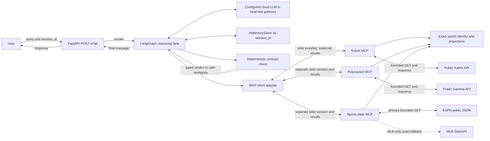
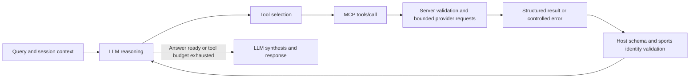
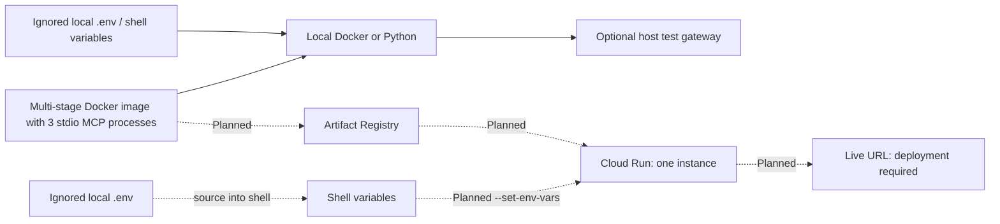

# Sports Prediction-Market Research

A read-only CSCI 599 course project for sports prediction-market research on Kalshi and
Polymarket. Initial support covers MLB, NFL, and NCAA Division I football game winners.
Three application MCP servers provide market discovery on each platform plus current game state
from ESPN, with an exact-identity MLB StatsAPI fallback. None place orders or access accounts.

Start with `kalshi_search_markets(query="Yankees")` or
`polymarket_search_markets(query="Chiefs vs Bills")`. No exchange taxonomy or constructed
ticker is required. For college football, use a school name and `league="ncaa_football"`.
Shared cities and ambiguous abbreviations produce clarification choices.
For a current score, start with
`sports_state_find_games(query="Yankees", league="mlb", timezone="America/Los_Angeles")`,
then copy one returned `game_ref` unchanged into `sports_state_get_game_state`.

## What is implemented

| Capability | Current behavior |
|---|---|
| Three independent MCP servers | Kalshi, Polymarket, and sports game state; real stdio discovery and calls |
| Sports discovery | MLB, NFL, NCAA Division I FBS/FCS; full-game winners only |
| Team identity | Exact aliases from a reviewed provider catalog; same-city teams stay distinct |
| Candidate selection | Results group both outcome contracts by game; separate event IDs preserve doubleheaders |
| Dates | Exact local dates, ranges, next/most-recent selection, and IANA timezones |
| Prices | Honest nullable quote clocks, explicit observation identity/cache reuse, stale flags, snapshots, trades, bids, and complements |
| Coverage | Actual pages/events/contracts scanned, partial-result warnings, truncation, continuation evidence, and scoped totals |
| Contract detail | Rules, game/close/resolution clocks, consumer links, and explicit settlement results |
| Current game state | ESPN scores/lifecycle/situations; MLB StatsAPI fallback after exact identity matching |
| Game-state identity | Opaque checksummed discovery references; league, teams, date, and start revalidated on detail |
| Application | FastAPI, LangGraph tool loop, session memory, local inspection UI |
| Comparison boundary | Typed event, named-outcome, and settlement checks run before synthesis for supported full-game winners |
| Comparison policy | Deterministic identity plus core settlement checks; unsupported or differing full rules cannot authorize price comparison |

External evidence research, forecasting, a saved-forecast ledger, and Cloud Run deployment are
**future work**. The matcher establishes equivalence when complete supplied full-game-winner
identity, named-outcome mapping, game-winner type, postponement/cancellation terms, and exact full
rules agree. Missing or differently worded rules remain ambiguous unless a core settlement conflict
already proves the contracts different. Sports-state data is optional corroboration, not proof of
contract equivalence or settlement.
A sporting result does not establish prediction-market settlement, even when the game is final.
The [Milestone 8A evaluation](docs/research/MATCHING_VALUE_EVALUATION.md) found no safe equivalent
pair in its real-market sample. It removed Jev and reduced matching to this deterministic subset.

The product can expand to additional sports and contract types, including spreads, totals,
props, and futures. These require verified provider mappings, typed models, settlement
checks, and tests; they are not enabled by adding team aliases. See the
[implementation plan](docs/planning/IMPLEMENTATION_PLAN.md) for acceptance criteria.

Read [Sports market MCP design](docs/research/SPORTS_MCP.md) for market discovery and
[Game-state MCP design](docs/research/GAME_STATE_MCP.md) for live-state contracts, provenance,
identity rules, budgets, cache semantics, errors, and provider limitations.

## Setup and run

Requires Python 3.12+ and [uv](https://docs.astral.sh/uv/).

```powershell
uv sync --all-extras
Copy-Item .env.example .env
```

Keep credentials in the ignored `.env`. The three market/state MCP servers need no exchange or
LLM credentials:

```powershell
uv run python -m market_agent.mcp.kalshi
uv run python -m market_agent.mcp.polymarket
uv run python -m market_agent.mcp.sports_state
```

These commands speak MCP on stdin/stdout; use an MCP client rather than an HTTP browser.
The packaged [server manifest](src/market_agent/mcp/servers.json) configures all three processes.

For the conversational application, configure `OPENAI_API_KEY` and run:

```powershell
uv run python main.py
```

The application binds to `0.0.0.0:$PORT` (default 8080). Its assignment endpoint is:

```text
POST /chat
{"query": "Find Kalshi Yankees game-winner markets", "session_id": "sports-1"}

Response:
{"response": "..."}
```

Reuse a session ID for follow-ups; use a new, unguessable ID for a new conversation.
IDs are not authentication. LangGraph memory lasts for the process lifetime.
Interactive HTTP documentation is at `/docs`.

## Tool reference

| Tool | Inputs |
|---|---|
| `kalshi_search_markets` | `query`, `status="open"`, game `limit=5`; optional league, local date/range, timezone, next/recent selector, continuation, series |
| `kalshi_search_series` | `query`, optional exact `category` and `tags`, `limit=5` |
| `kalshi_get_market` | Exact returned uppercase `market_id` |
| `polymarket_search_markets` | `query`, `status="open"`, game `limit=5`; optional league, local date/range, timezone, next/recent selector, continuation |
| `polymarket_get_market` | Exact returned numeric Gamma `market_id` |
| `sports_state_find_games` | `query`, required `league` and IANA `timezone`; optional exact `local_date`, game `limit=5`, `compact=false` |
| `sports_state_get_game_state` | Exact opaque `game_ref` copied unchanged from discovery |

- Limits are strict integers from 1 through 10 in the client-visible MCP schema.
- League values are `mlb`, `nfl`, and `ncaa_football`.
- `local_date`, `date_from`, and `date_to` are scheduled calendar dates in `timezone`
  (an IANA name such as `America/Los_Angeles`). `event_date` remains an exact-date alias.
- `next_game_only` and `most_recent_game_only` are mutually exclusive. Sports `limit` counts
  games; each `games[]` entry contains its returned `contracts[]`.
- Sports discovery accepts full-game winners; it does not substitute a spread, total,
  partial-game winner, player prop, season series, or future.
- Clarification results include `clarification` and `choices`; they do not trigger upstream requests.
- Every game has a localized kickoff label and `pregame`, `live`, `awaiting_resolution`, or
  `settled` state. Two games on the same day remain separate.
- Pass `discovery.next_cursor` back as `continuation` to read the next bounded page.
- Continuations are opaque and request-bound. Provider, query, league, status, calendar filters,
  and selectors are validated before any upstream request; do not edit or cross-use cursors.
- Caller-correctable failures are MCP tool errors containing JSON with stable `error.code`,
  `message`, and `fields`. Correct the named fields before retrying the call.
- `discovery.discarded_record_count` and `warnings` report malformed/oversized individual provider
  records. Valid candidates from the same structurally valid page are still returned.
- Explicit series discovery is an optional precision control, not a prerequisite for an
  ordinary sports query.
- `quote_as_of` is an authoritative provider quote clock or null; it never aliases `retrieved_at`.
  `provider_updated_at` remains provider record metadata. `observation_id`, `cache_hit`, and
  `cache_age_ms` identify explicit 30-second normalized-observation reuse across search/detail.
  Missing quote timing is stale with a reason instead of being assigned the retrieval time.
- Sports contracts retain `timezone`, `local_date`, and `scheduled_start_local` in their normalized
  `sports` object, including an immediate detail call after search.
- Fetch details before interpreting settlement rules. Resolved details expose
  `settlement_value`, `winning_outcome`, and `resolved_at`; prices are not settlement evidence.
- Game-state discovery checks one requested local day and at most two adjacent UTC boundary pages;
  it never scans a season. Omitting `local_date` uses and discloses today in the requested timezone.
- Game-state discovery is a lightweight picker. Use `query="all"` for a bounded same-day league
  slate of at most 10 games; this is not exhaustive pagination or a season scan. Its `usage_note`
  directs callers to detail for authoritative normalized state fields.
- Set `compact=true` for multi-game selection results containing only teams, timing, lifecycle, and
  `game_ref`; league/timezone/date remain at result root. Clarifications use
  `discovery_mode="clarification"` and machine-ready queries.
- `coverage.utc_boundary_check` explains when two ESPN UTC pages were needed to cover one local
  calendar day. It does not indicate that discovery widened the requested local date.
- `game_ref` is restart-safe, versioned, checksummed, and bound to the ESPN game, league, teams,
  scheduled start, and timezone. It is not a credential and must not be edited or reconstructed.
  Rediscovery in another timezone intentionally returns a different reference.
- Game state returns one baseball or football situation object. Missing possession, count, outs,
  bases, players, timeouts, or field position remain null rather than being inferred.
- Scheduled/pregame provider placeholders are normalized to null in discovery and detail; baseball
  `half` is `unknown` until an inning exists. Baseball `phase` distinguishes `not_started`, active
  play, provider transitions, completed games, and unavailable situation data.
- ESPN is free, unauthenticated, undocumented, and has no SLA. MLB StatsAPI is the MLB-only
  fallback; NFL and NCAA failures return controlled unavailability without substitution.
- `retrieved_at` is this service's observation time. Cached state keeps that original time and
  exposes `observation_id`, `cache_hit`, and `cache_age_ms`.
- Live discovery and detail are separate observations and can drift between calls. Detail is
  authoritative for normalized live state; do not merge live fields as one transactional snapshot.
- Empty bounded discovery is not proof of absence. Polymarket automatically checks its league
  catalog when exhausted text search yields no qualifying game and page budget remains.

## Local inspection UI

```powershell
uv run python scripts/run_chat_ui.py
```

This starts Market Lens at `http://127.0.0.1:3000`, the FastAPI backend, and the local
Codex test gateway. The gateway supplies model decisions; the application still owns
LangGraph memory and performs real MCP calls. The UI shows actual tool activity and
supports session follow-ups. Ctrl+C stops the local processes.

The default local test model is `gpt-5.6-sol` with medium effort. UI controls also support
the configured Terra/Luna options and reasoning levels. This development gateway uses local
CLI authentication and stays outside the deployment image. It is not a production API backend.
Use `--no-browser` or `--port 3001` on the runner as needed.

For separate gateway/backend terminals:

```powershell
uv run python scripts/codex_gateway.py
# In another terminal:
$env:OPENAI_API_KEY = "local-codex-placeholder"
$env:OPENAI_BASE_URL = "http://127.0.0.1:8091/v1"
$env:LLM_TIMEOUT_SECONDS = "120"
uv run python main.py
```

Clear these overrides before using the configured cloud model.

## Verification

```powershell
uv run pytest -m "not live_smoke"
uv run ruff check .
uv run ruff format --check .
uv run mypy src
```

The deterministic suite uses fixture HTTP and scripted model replies while exercising real
MCP sessions and the agent. It does not require a currently open game.

Bounded public checks:

```powershell
$env:RUN_LIVE_SMOKE = "1"
uv run pytest tests/live/test_game_state_mcp_live.py tests/live/test_sports_mcp_live.py tests/live/test_market_clients_live.py tests/live/test_kalshi_mcp_live.py tests/live/test_polymarket_mcp_live.py
Remove-Item Env:RUN_LIVE_SMOKE
```

The sports live checks discover schemas, reject `limit=20`, search all three supported
leagues, and retrieve a returned contract or game state when available. Empty current slates are
valid. They do not fabricate an expected open game. See [Testing](docs/research/TESTING.md) for test boundaries
and [Provider contracts](docs/research/MARKET_API_FEASIBILITY.md) for primary sources.

Real-model checks are separate: configure a backend, set `RUN_LIVE_AGENT=1`, and run
`tests/live/test_chat_live.py`. Scripted-model tests establish schema consumption and control
flow, not model selection quality.

## Container and deployment

```powershell
docker build -t market-agent:local .
docker run --rm -p 8080:8080 --env-file .env market-agent:local
```

The multi-stage image installs locked runtime dependencies and runs as UID 10001.
It includes the three application MCP servers and requires no Node runtime. For Docker Desktop with
the host test gateway, override `OPENAI_BASE_URL=http://host.docker.internal:8091/v1`
and use a local placeholder API key.

Cloud Run is not deployed. Deployment remains an assignment deliverable:
build the image, publish it to Artifact Registry, deploy with runtime environment variables,
one worker and `--max-instances 1`, then verify the live `POST /chat` URL and memory.
The [assignment](docs/assignment/Assignment_1_Description.md) supplies the deployment commands
and required submission contract. Never deploy the local CLI gateway or copy local credentials
into an image.

Public market, ESPN, and MLB StatsAPI calls use no account credentials in this implementation.
The game-state providers are free but supply no availability guarantee. LLM usage, Cloud Run,
builds, image storage, and future external research can incur provider charges.
There is no continuous polling or background research. No latency or bandwidth improvement is
claimed without measurement.

## Architecture







The servers are student-authored using the official
[MCP Python SDK](https://github.com/modelcontextprotocol/python-sdk).
The application uses [LangGraph](https://docs.langchain.com/oss/python/langgraph/overview),
[FastAPI](https://fastapi.tiangolo.com/), and
[langchain-mcp-adapters](https://github.com/langchain-ai/langchain-mcp-adapters).

## Documentation map

- [Sports MCP design and catalog maintenance](docs/research/SPORTS_MCP.md)
- [Sports game-state MCP design](docs/research/GAME_STATE_MCP.md)
- [Runtime architecture](docs/research/MCP_VERTICAL_SLICE.md)
- [Provider contracts and field mapping](docs/research/MARKET_API_FEASIBILITY.md)
- [Current matching and future sports comparison](docs/research/CONTRACT_MATCHING.md)
- [Testing](docs/research/TESTING.md)
- [Product scope](docs/planning/PROJECT_PROPOSAL.md)
- [Remaining implementation plan](docs/planning/IMPLEMENTATION_PLAN.md)

`PROCESS_LOG.md` is Rylan Wade's personal reflection and remains a required submission
artifact. `AI_TRANSCRIPT.md` is separate automatic development evidence, governed by
`AGENTS.md`; it does not replace personal authorship.
