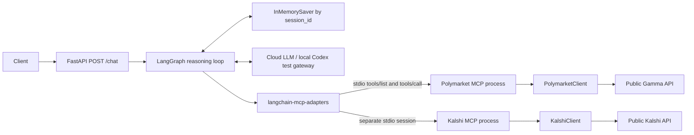
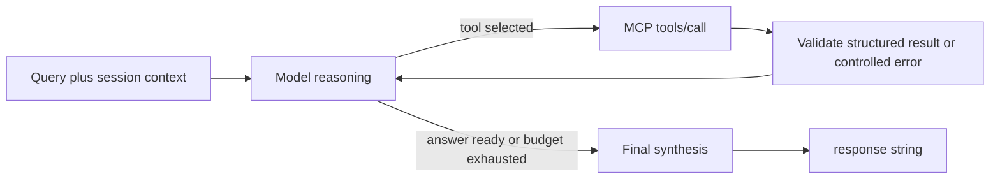
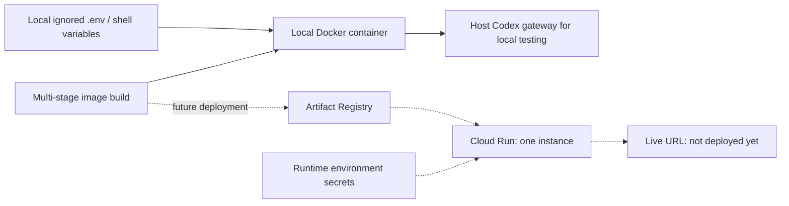

# Prediction Market Research Agent

This repository contains CSCI 599 Assignment 1: a tool-using agent with MCP integration,
conversational memory, and a planned Google Cloud Run deployment. Through Milestone 5,
the working **Prediction Market Contract Reader** explains what a contract actually settles on,
alongside its quoted price, source, and material caveats.

Try: “Read Polymarket market 561229: what makes YES win, and what rule could surprise me?”
Then: “Which organizations did those rules name?” using the same session ID.
Search by topic when you do not know an ID. The agent can discover candidates, fetch their
rules, and explain them through one conversational endpoint.

## Proposed Project

The project is a read-only research agent for binary events listed on both Polymarket and Kalshi. It will find comparable contracts, verify that their resolution rules describe the same outcome, inspect a bounded set of related contracts and current news, and return a concise probability assessment that the user may save for later evaluation.

The proposed workflow is:

1. Search Polymarket and Kalshi for a primary contract pair and up to three related contracts per platform.
2. Normalize dates, thresholds, and outcome direction in code.
3. Use Jev for the narrow decision of whether the primary contracts are equivalent.
4. Gather current evidence with a fixed Tavily search budget.
5. Use GPT-5 to synthesize the evidence and return `YES`, `NO`, or `NO POSITION`.
6. Save a forecast through the SQLite ledger only when requested.

## Proposed Architecture

- LangGraph agent with a FastAPI `POST /chat` endpoint.
- LangGraph checkpointer keyed by `session_id` for conversational memory.
- Polymarket, Kalshi, Tavily, and SQLite MCP servers.
- OpenAI GPT-5 for tool selection and evidence synthesis.
- Jev through Vercel AI Gateway for contract-equivalence classification.
- Docker deployment to Google Cloud Run.

The scope excludes trading, brokerage connections, continuous monitoring, automated settlement, dashboards, and custom price-prediction models.

## Development Approach

This course is designed to teach practical development with AI tools, so LLM-assisted coding, debugging, and refactoring are expected parts of the project workflow. The student remains responsible for understanding the system, verifying its behavior, and explaining the implementation and design decisions.

## Development Setup

Python 3.12 or newer and [uv](https://docs.astral.sh/uv/) are required for local development. From the repository root:

```powershell
uv sync --all-extras
Copy-Item .env.example .env
```

Replace only the placeholder values in the ignored `.env` file. Configuration validation reports missing required variables without printing their values.

Run the local quality suite:

```powershell
uv run pytest -m "not live_smoke"
uv run ruff check .
uv run mypy src
```

Test markers separate isolated unit tests, local integration tests, and opt-in live checks:

```powershell
uv run pytest -m unit
uv run pytest -m integration
uv run pytest -m live_smoke
```

Live-smoke tests are never part of the default deterministic suite.

## Market Data Layer

Milestone 2 provides typed, asynchronous, read-only clients without MCP wrappers:

```python
from market_agent.providers import KalshiClient, PolymarketClient

async with PolymarketClient() as polymarket:
    candidates = await polymarket.search_markets("2028 presidential election", limit=5)

async with KalshiClient() as kalshi:
    market = await kalshi.get_market("KXPRESPERSON-28-JVAN")
```

Both clients return the shared `CanonicalMarket` type and raise typed errors for transport, HTTP,
validation, and missing-data failures. Normal tests use saved fixtures. Run the bounded public API
checks only when intended:

```powershell
$env:RUN_LIVE_SMOKE = "1"
uv run pytest -m live_smoke
Remove-Item Env:RUN_LIVE_SMOKE
```

The provider findings, endpoint choices, limitations, and fixture policy are documented in
[Market API feasibility](docs/research/MARKET_API_FEASIBILITY.md).

## Polymarket MCP

Start the student-authored server with `uv run python -m market_agent.mcp.polymarket`.
It speaks MCP over stdio; it is intended to be launched by an MCP client, not called as an HTTP API.
It needs no exchange or LLM credentials. Only public read-only Gamma endpoints are used.

- `polymarket_search_markets(query, status="open", limit=5)`: at most 10 candidate summaries.
- `polymarket_get_market(market_id)`: current prices and bounded resolution rules for a numeric ID.
- Prices are decimal strings, missing fields are null, and truncated rules are explicitly labeled.
- Search covers a bounded first page; empty results are not proof of market absence.

Protocol tests: `uv run pytest tests/integration/test_polymarket_mcp.py`.
Public subprocess check: set `RUN_LIVE_SMOKE=1`, then run
`uv run pytest tests/live/test_polymarket_mcp_live.py`.

The server uses the official [MCP Python SDK](https://github.com/modelcontextprotocol/python-sdk)
FastMCP implementation. See [implementation evidence](docs/research/MCP_VERTICAL_SLICE.md)
for dependency compatibility, transport, lifecycle, bounds, and verification results.

## Kalshi MCP and Platform Selection

Start the independent server with `uv run python -m market_agent.mcp.kalshi`.
It exposes `kalshi_search_markets(query, status="open", limit=5)` and
`kalshi_get_market(market_id)` using a full uppercase market ticker such as
`KXPRESPERSON-28-JVAN`. Search accepts open, closed, resolved, or null status.
It scans at most three event pages and retrieves at most ten candidate events. Discovery is
incomplete; a known ticker supports a direct detail lookup. No account credentials are needed.

The packaged [server manifest](src/market_agent/mcp/servers.json) declares two separate stdio
processes; runtime uses the current Python interpreter. Each turn discovers both servers,
while the model selects which tools to invoke. A Polymarket-only request calls only Polymarket;
a Kalshi-only request calls only Kalshi. General explanations need neither tool. One unavailable
server does not prevent using the other. Results include platform identity to prevent mix-ups.

Try: “Compare Polymarket 561229 with Kalshi KXPRESPERSON-28-JVAN. What differs in the rules?”
This retrieves both contracts; similar headlines alone do not establish equivalence.
Follow up with “What was the Kalshi price?” to use the remembered snapshot.
Formal deterministic matching follows in Milestone 6.

## Run the Vertical Slice

With a real `OPENAI_API_KEY` in the ignored `.env`, run `uv run python main.py`.
The default cloud backend is `gpt-5`; `OPENAI_MODEL` and `OPENAI_BASE_URL` are configurable.
Tavily credentials are not required until its later milestone. The server binds to
`0.0.0.0`, reads `PORT` (default 8080), and exposes interactive API documentation at `/docs`.

```powershell
Invoke-RestMethod -Method Post -Uri http://localhost:8080/chat `
  -ContentType application/json `
  -Body '{"query":"Find two Polymarket Bitcoin contracts","session_id":"research-1"}'
```

Responses have exactly `{"response":"..."}`. Invalid bodies return 422. Session IDs accept
1–128 letters, digits, underscores, or hyphens; queries accept 1–4,000 characters.
Use a new, unguessable session ID for each conversation. Session IDs are not authentication.

### Local testing with headless Codex

This opt-in development route uses saved Codex CLI authentication, **gpt-5.6-sol at medium
effort only**, with no API billing credentials. The gateway runs outside the deployment image.
It returns model decisions; LangGraph still discovers and calls the real MCP server.

Terminal 1:

```powershell
uv run python scripts/codex_gateway.py
```

Terminal 2:

```powershell
$env:OPENAI_API_KEY = "local-codex-placeholder"
$env:OPENAI_BASE_URL = "http://127.0.0.1:8091/v1"
$env:LLM_TIMEOUT_SECONDS = "120"
uv run python main.py
```

The gateway binds only to localhost. It launches ephemeral CLI calls in temporary directories,
passes prompts through stdin, suppresses CLI diagnostics, and does not execute market tools itself.
Set `CODEX_EXECUTABLE` if the CLI cannot be located. Stop both processes with Ctrl+C.
Clear those environment overrides before testing the real cloud API. CLI usage limits still apply.
This is a local test backend, not a production API replacement or proof of GPT-5 behavior.

### Container

```powershell
docker build -t market-agent:m4 .
docker run --rm -p 8080:8080 --env-file .env market-agent:m4
```

For local Codex testing from Docker Desktop, keep the host gateway running and use:

```powershell
docker run --rm -p 8080:9090 -e PORT=9090 `
  -e OPENAI_API_KEY=local-codex-placeholder `
  -e OPENAI_BASE_URL=http://host.docker.internal:8091/v1 `
  -e LLM_TIMEOUT_SECONDS=120 market-agent:m4
```

The multi-stage image installs locked runtime dependencies with uv and runs as UID 10001.
No Node, Codex, dev dependencies, source credentials, or host authentication files are included.
Cloud Run deployment remains a later milestone; there is no live deployment URL yet.

### Verification and operating limits

- Offline suite: `uv run pytest -m "not live_smoke"`; Ruff lint/format and `uv run mypy src`.
- Public API suite: `RUN_LIVE_SMOKE=1`, then `uv run pytest tests/live/test_market_clients_live.py`.
- Public MCP subprocess: same flag, `uv run pytest tests/live/test_polymarket_mcp_live.py`.
- Real model + MCP: configure the cloud backend or local gateway, set `RUN_LIVE_AGENT=1`,
  then `uv run pytest tests/live/test_chat_live.py`. This makes real model and public API calls.
- Deterministic graph tests use a scripted model and fixture HTTP; they do not measure semantic
  selection. Live checks inspect actual tool names/statuses without recording prompts or payloads.
- Each available market server gets its own stdio subprocess and session per turn, then closes.
  A later request retries connection naturally. Total discovery failure returns a controlled response.
- Four tool calls per turn; bounded model/HTTP/MCP timeouts. The model chooses tools semantically.
- Memory uses LangGraph InMemorySaver and lasts for one process. Run one worker/instance for
  the assignment. Memory is not durable or currently evicted; long-running public use needs limits.
- No trading, independent forecasting, news, deterministic matching, or saved forecasts yet.
- GPT-5 cloud access was not verified without a key. Headless Sol tests do not establish GPT-5 quality.

## Current Architecture







These diagrams describe the implemented slice; future servers will be added as they become real.
The application uses [LangGraph](https://docs.langchain.com/oss/python/langgraph/overview),
[FastAPI](https://fastapi.tiangolo.com/), and
[langchain-mcp-adapters](https://github.com/langchain-ai/langchain-mcp-adapters).

## Project Documents

- [Focused project proposal](docs/planning/PROJECT_PROPOSAL.md)
- [Implementation plan](docs/planning/IMPLEMENTATION_PLAN.md)
- [Assignment requirements](docs/assignment/Assignment_1_Description.md)
- [Original assignment PDF](docs/assignment/Assignment_1_Description.pdf)
