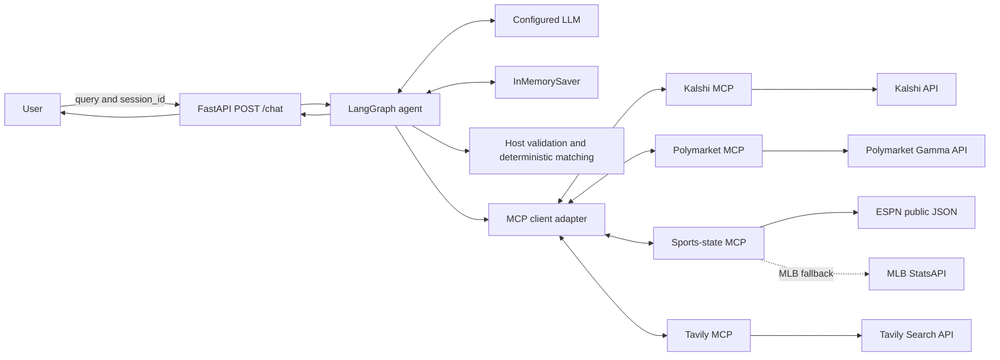
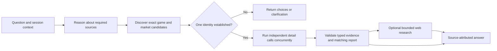
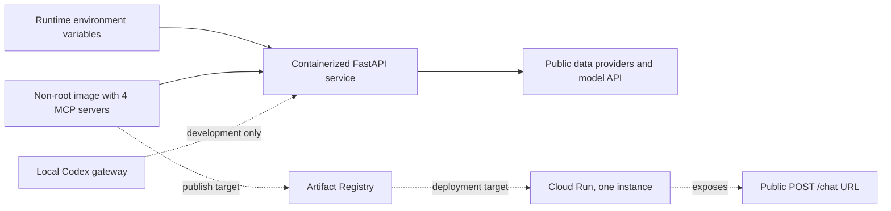

# Market Lens

> Sports research that knows whether every source is talking about the same game.

Market Lens turns one game into a connected, source-checked research thread. Start with the score,
drill into a player or play, inspect Kalshi and Polymarket, then check the news around the game
without rebuilding the context in every tab.

The application covers MLB, NFL, and NCAA Division I football. It resolves the exact game before
combining sources, so a similar matchup name or stale snapshot does not quietly become part of the
answer.

## Follow one game across every source

A research thread can move through questions like these without starting over:

1. "What's happening in the Yankees game?"
2. "Show me the pitchers and the last five plays."
3. "How are Kalshi and Polymarket pricing it?"
4. "Do those contracts actually settle under the same rules?"
5. "Any lineup or injury news that changes the context?"

Market Lens keeps the selected game attached to the thread. A direct question receives a direct
answer. A broad request can expand into a sourced brief with game state, statistics, market
snapshots, contract terms, and current reporting.

## The hard part is joining evidence safely

Fetching a score is straightforward. The failure-prone step is deciding whether a scoreboard
event, two market contracts, and a news report describe the same game under the same conditions.
Market Lens makes that decision before it writes the answer.

| Research problem | Market Lens response |
|---|---|
| Providers use different IDs and team labels | Discover the event through each provider and validate league, participants, date, and scheduled start |
| Scores, quotes, and articles arrive at different times | Keep each observation separate and show its retrieval or quote time |
| Two contracts have similar headlines | Check named outcomes and available settlement terms before comparing prices |
| One provider is unavailable | Name the missing source and return a useful answer from the evidence that passed validation |

You can keep asking questions without losing track of what each source actually proved.
A sporting result does not establish prediction-market settlement. A market price is not an
independent forecast. Missing timestamps, incomplete rules, and weak research evidence stay visible
in the answer.

## Questions it handles

- What is the score, inning, count, or down and distance for this game?
- Show the box score, one player's game line, or the latest five plays.
- Find the Kalshi or Polymarket full-game-winner contract for this matchup.
- Compare two market contracts when their event and settlement terms support comparison.
- Build a sourced game brief with current state, market snapshots, injuries, lineups, weather, or
  schedule news.

Market Lens is read-only. It does not place orders, access market accounts, generate an independent
win probability, or make betting picks.

## System design

The primary product is a FastAPI service backed by a LangGraph reasoning loop. LangGraph owns
session memory, source availability, tool budgets, host-side schema validation, and final answer
synthesis. Four independent MCP servers expose focused, typed tools:

| Source | Responsibility |
|---|---|
| Kalshi MCP | Sports contract discovery, exact contract detail, prices, rules, links, and settlement fields |
| Polymarket MCP | Sports contract discovery through Gamma, exact detail, prices, rules, links, and settlement fields |
| Sports-state MCP | Exact-game state, box scores, player game statistics, and bounded play history |
| Tavily MCP | At most two identity-bound searches for injuries, lineups, weather, schedule changes, game news, or recaps |

Independent calls from one reasoning step execute concurrently. Identifier-dependent detail and
research calls wait until discovery establishes the required identity. Each turn allows eight
market or sports-state calls and two Tavily searches.

### Trust boundaries

- ESPN public JSON is the primary sports-state source. It is free, unauthenticated, undocumented,
  and has no SLA.
- MLB StatsAPI is an MLB-only fallback after exact game identity checks. NFL and NCAA football do
  not receive a substituted fallback.
- Market prices are provider observations, not model forecasts. Quote time and retrieval time are
  different fields.
- Tavily titles and snippets are bounded, untrusted evidence. They cannot establish structured
  game state, contract equivalence, or settlement.
- Contract rules are also untrusted input. Truncated or differing rules cannot support a complete
  equivalence decision.

## Run locally

Requirements: Python 3.12+ and [uv](https://docs.astral.sh/uv/).

```powershell
uv sync --all-extras
Copy-Item .env.example .env
```

Set `OPENAI_API_KEY` in the ignored `.env`, then start the service:

```powershell
uv run python main.py
```

The application listens on `0.0.0.0:$PORT`, with port 8080 as the default. Interactive API
documentation is available at `/docs`.

### API

```http
POST /chat
Content-Type: application/json

{
  "query": "Give me a sourced Yankees game brief",
  "session_id": "sports-1"
}
```

```json
{"response":"..."}
```

Reuse a session ID for follow-ups. Use a new, unguessable ID for a separate conversation. Session
IDs are not authentication, and the in-memory LangGraph checkpointer lasts for the process
lifetime.

### Inspection UI

```powershell
uv run python scripts/run_chat_ui.py
```

This starts Market Lens at `http://127.0.0.1:3000`, the FastAPI backend, and a local Codex model
gateway. The application still owns LangGraph memory and MCP execution. The UI displays the actual
tool activity for each turn. The gateway uses local CLI authentication and is not included as a
production backend.

## Test the MCP workflow in Codex

The repository includes [the sports-information skill](.agents/skills/sports-information/SKILL.md).
Codex discovers it from the repository and uses the configured `kalshi`, `polymarket`,
`sports_state`, and `tavily` MCP connections.

```powershell
codex exec '$sports-information Find today''s MLB games in UTC. Use sports state only.'
```

This path is a direct MCP test surface. It checks tool discovery, routing instructions, schemas,
and provider behavior inside a normal Codex conversation. It does not exercise the application's
LangGraph memory, host-side deterministic matcher, per-turn budgets, or `/chat` contract. The
FastAPI and LangGraph path remains the product and assignment implementation.

## MCP tool surface

| Tool | Purpose |
|---|---|
| `kalshi_search_markets` | Find Kalshi candidates by ordinary team or matchup text |
| `kalshi_search_series` | Narrow discovery with an exact Kalshi sports series |
| `kalshi_get_market` | Retrieve one returned Kalshi ticker |
| `polymarket_search_markets` | Find Polymarket candidates by ordinary team or matchup text |
| `polymarket_get_market` | Retrieve one returned numeric Gamma market ID |
| `sports_state_find_games` | Resolve one game by query, league, local date, and IANA timezone |
| `sports_state_get_game_state` | Read score, lifecycle, and sport-specific situation |
| `sports_state_get_box_score` | Read a summary, full layout, or one box-score section |
| `sports_state_list_players` | List players with provider-backed game-stat lines |
| `sports_state_get_player_stats` | Read one returned player's game statistics |
| `sports_state_get_play_by_play` | Read a chronological, paged window of plays |
| `tavily_search_game_evidence` | Search current evidence for one established game identity |

Market IDs, `game_ref`, player IDs, and play IDs are opaque. Consumers copy returned values
unchanged. Sports discovery supports full-game winners; spreads, totals, props, partial-game
winners, series, and futures require separate schemas and settlement rules.

## Verification

The default test suite uses recorded HTTP fixtures and scripted model decisions while exercising
real in-memory MCP sessions:

```powershell
uv run pytest -m "not live_smoke"
uv run ruff check .
uv run ruff format --check .
uv run mypy src
```

Bounded public-provider checks are opt-in:

```powershell
$env:RUN_LIVE_SMOKE = "1"
uv run pytest tests/live
Remove-Item Env:RUN_LIVE_SMOKE
```

The live checks accept empty slates and evidence sets. They validate schemas and bounded provider
behavior without assuming that a specific game or market is open. Real-model checks are separate:
set `RUN_LIVE_AGENT=1` and run `tests/live/test_chat_live.py` with a configured model backend.

## Container and Cloud Run

```powershell
docker build -t market-agent:local .
docker run --rm -p 8080:8080 --env-file .env market-agent:local
```

The multi-stage image installs locked runtime dependencies, runs as UID 10001, and includes all
four Python MCP processes. It requires no Node runtime.

Cloud Run deployment uses one worker and `--max-instances 1` so the assignment's in-process session
memory remains coherent within the service instance. Deployment requires an Artifact Registry
image and runtime environment variables. The local Codex gateway and local credentials never enter
the image. The live Cloud Run URL is a remaining submission deliverable.

Public market, ESPN, and MLB StatsAPI requests require no account credentials. Model inference,
Cloud Run, Cloud Build, Artifact Registry storage, and keyed Tavily searches can incur provider
charges. The service performs no continuous polling or background research.

## Architecture







## Assignment context

This repository implements CSCI 599 Assignment 1: a deployed tool-using agent with MCP integration
and conversational memory. The product design extends the assignment's minimum contract with
typed sports data, source provenance, deterministic market checks, and direct Codex testing.

- [Assignment implementation and submission mapping](docs/assignment/IMPLEMENTATION_ALIGNMENT.md)
- [Canonical assignment description](docs/assignment/Assignment_1_Description.md)
- [Runtime architecture](docs/research/MCP_VERTICAL_SLICE.md)
- [Testing strategy](docs/research/TESTING.md)
- [Product scope](docs/planning/PROJECT_PROPOSAL.md)
- [Implementation milestones](docs/planning/IMPLEMENTATION_PLAN.md)

`PROCESS_LOG.md` is Rylan Wade's personal reflection. `AI_TRANSCRIPT.md` is separate development
evidence governed by `AGENTS.md`; it does not replace personal authorship.

## Technical references

- [Sports market MCP design](docs/research/SPORTS_MCP.md)
- [Sports-state MCP design](docs/research/GAME_STATE_MCP.md)
- [Tavily research MCP design](docs/research/WEB_RESEARCH_MCP.md)
- [Contract matching](docs/research/CONTRACT_MATCHING.md)
- [MCP Python SDK](https://github.com/modelcontextprotocol/python-sdk)
- [LangGraph](https://docs.langchain.com/oss/python/langgraph/overview)
- [FastAPI](https://fastapi.tiangolo.com/)
