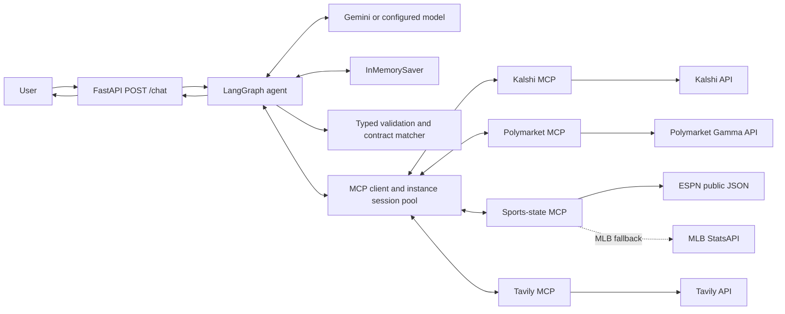
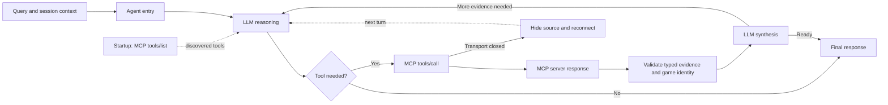
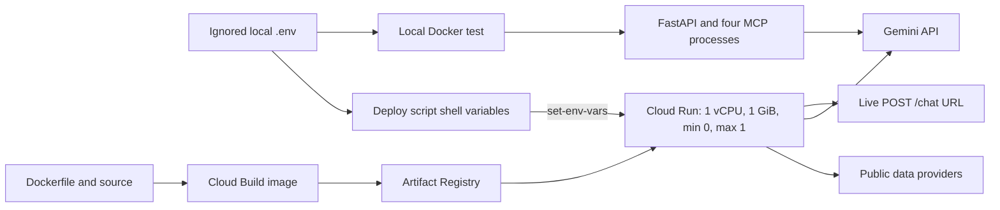

# SportsWatch MCP

Sports scores, prediction-market prices, and game news come from separate sources. A score,
contract, and article can mention the same team but refer to different games. SportsWatch checks
league, teams, date, and scheduled start before combining them.

Four custom MCP servers connect the agent to game state, Kalshi, Polymarket, and
game-specific Tavily research, allowing it to answer focused questions or assemble a sourced
game brief.

The service answers MLB, NFL, and NCAA Division I football questions about scores, box scores,
player statistics, plays, Kalshi and Polymarket contracts, and news. Session memory lets users
ask follow-ups about the same game without repeating it. It is read-only: no trades, account
access, betting picks, or model-made win probabilities.

## Live example

One request to the deployed `POST /chat/inspect` asked: "Give me a full report on the October 6,
2026 Brewers at Padres NLDS Game 3. Include the live game state and box score, Kalshi and
Polymarket contracts, current playoff-series news, and paternity-list roster moves. Cite the news
articles you find." It returned HTTP 200 and recorded nine successful MCP calls:

| Tool | Result |
| --- | --- |
| `sports_state_find_games` | Found one game: Brewers at Padres. |
| `kalshi_search_markets` | Found one game with Padres contracts. |
| `polymarket_search_markets` | Found one Brewers-Padres game. |
| `sports_state_get_game_state` | Live, bottom of the fifth; Padres 3, Brewers 2. |
| `sports_state_get_box_score` | Returned a partial summary box score. |
| `kalshi_get_market` | Returned San Diego YES last trade at 0.7200 and contract rules. |
| `polymarket_get_market` | Returned San Diego snapshot price at 0.715 and different settlement rules. |
| `tavily_search_game_evidence` (`other_game_news`) | Retained five sources, including [MLB's Game 3 preview](https://www.mlb.com/news/brewers-padres-nl-division-series-game-3-starting-lineups-and-pitching-matchup) as series context. |
| `tavily_search_game_evidence` (`roster_moves`) | Retained five sources, including [NBC Sports on Mason Miller's paternity-list placement](https://www.nbcsports.com/mlb/news/star-closer-mason-miller-goes-on-paternity-list-before-padres-face-brewers-in-game-3-of-nlds) for this game. |

The ESPN observation was at 8:27 PM PDT on October 6. The answer reported Jake Cronenworth's
home run, Nick Pivetta's 4.1 innings and two earned runs, and Mason Miller's paternity-list move.
It did not treat the two market prices as equivalent: Kalshi has a 48-hour reschedule window and
fair-value cancellation, while Polymarket waits for game completion and pays 50-50 on
cancellation. Scores and prices above are from that snapshot, not current values.

## Deployed stack


| Component | Deployed version |
| --- | --- |
| Language | Python 3.12 |
| HTTP API | FastAPI (`POST /chat`) |
| Agent | LangGraph with LangChain model integration |
| Memory | LangGraph `InMemorySaver`, keyed by `session_id` |
| MCP | Four custom servers built with FastMCP from the MCP Python SDK, connected through `langchain-mcp-adapters` |
| Model | Gemini 3.8 Flash via the Google Gemini API |
| Container | Docker |
| Hosting | Google Cloud Run |
| Cloud Run URL | Redacted; available on request |

## Evidence checks

1. **Event identity.** SportsWatch compares league, teams, date, scheduled start, and game number
   where available. Doubleheaders and similarly named matchups stay separate. The app does not
   equate IDs from different providers.
2. **Contract equivalence.** A deterministic matcher checks the named outcome, full-game
   scope, postponement window, cancellation payout, and complete supplied rules. It returns
   `equivalent`, `different`, or `ambiguous`. The model cannot change an `ambiguous` verdict to
   `equivalent`. A final sporting result does not establish prediction-market settlement.
3. **Source times.** Each score, price, and article keeps its own observation time. The app
   validates tool results and checks game identity before passing them to the model. The answer
   identifies missing evidence.

## System design

The agent discovers tools from the four MCP servers with `tools/list` and invokes them with
`tools/call`.

| Server | Why it exists |
| --- | --- |
| Sports-state MCP | Resolves an exact game, then returns state, box scores, player lines, and bounded play history. ESPN public JSON is primary; MLB StatsAPI is an MLB-only fallback. |
| Kalshi MCP | Finds sports contracts and returns provider-backed prices, rules, and settlement fields for an exact ticker. |
| Polymarket MCP | Finds Gamma sports markets and returns exact market detail by returned numeric ID. |
| Tavily MCP | Adds bounded, game-specific reporting after the game identity is established. |

LangGraph handles model-driven tool choice and session memory through `InMemorySaver`. The host
validates each tool result and computes market-to-market and market-to-game checks before final
synthesis. Independent calls in one reasoning step can run concurrently; a detail call waits for
the identifier returned by discovery. Each turn is capped at eight market or state calls and two
Tavily searches.

FastAPI discovers the four stdio servers concurrently when a container starts and reuses those
sessions across requests. A closed transport removes only that server from new turns and is
reconnected after active turns release it. Tool errors and malformed responses are handled per
call. There is no background keepalive.

Returned `game_ref`, player IDs, market IDs, and tickers are opaque; callers pass them to detail
tools unchanged.

### Data boundaries

- ESPN public JSON is undocumented and has no SLA. MLB StatsAPI is an MLB-only fallback after
  exact game checks. NFL and college football have no fallback.
- Prices come from Kalshi or Polymarket. The app reports quote time and retrieval time
  separately. Game completion does not imply contract settlement.
- Search snippets cannot prove a score, contract equivalence, or settlement rule. Truncated or
  differing rules leave a comparison `ambiguous` unless an explicit conflict proves it
  `different`.
- Matching currently covers supported full-game winner contracts. Spreads, totals, props,
  futures, and partial-game winners need different identity and settlement checks.

## Run locally

Requires Python 3.12+ and [uv](https://docs.astral.sh/uv/). The deployed model defaults to
Gemini 3.8 Flash at low reasoning effort. `OPENAI_API_KEY` and an OpenAI-compatible base URL are
available for local alternatives; a nonempty Gemini key takes precedence. `TAVILY_API_KEY` is
optional; without it Tavily runs keyless and is rate limited after a few searches. The
app forwards the key to the Tavily MCP subprocess explicitly, so a Cloud Run environment
variable reaches it.

```powershell
uv sync --all-extras
Copy-Item .env.example .env
```

Set `GEMINI_API_KEY` in the ignored `.env`, then start the service:

```powershell
uv run python main.py
```

For local use, [Kessel](https://github.com/waderylan/kessel) can run this agent through a
Codex or Claude Code login.

The API binds to `0.0.0.0` and reads `PORT` (default 8080). `POST /chat` takes `query` and
`session_id` and returns `response`:

```powershell
$body = @{ query = "What's the Yankees score?"; session_id = "demo-1" } | ConvertTo-Json
Invoke-RestMethod http://127.0.0.1:8080/chat -Method Post -ContentType application/json -Body $body
```

Reuse the session ID for follow-ups. `/chat/inspect` accepts the same body and adds bounded tool
activity; `/health` reports service health. Session IDs are not authentication. Memory lasts for
the running instance and is lost when Cloud Run scales to zero or replaces it.

### Verify

```powershell
uv run pytest -m "not live_smoke"
uv run ruff check .
uv run ruff format --check .
uv run mypy src
```

Recorded fixtures and scripted model decisions keep the default suite independent of paid
model calls. Opt-in provider and real-model checks live in `tests/live/`. The
[adversarial test report](docs/research/ADVERSARIAL_TESTING_REPORT.md) covers transport closure,
tool errors, invalid responses, and provider failures.

## Deploy and cost

The multi-stage Docker image uses locked Python dependencies, runs as a non-root user, and needs
no Node runtime. For a local container check:

```powershell
docker build -t sportswatch-mcp:local .
docker run --rm -p 8080:8080 --env-file .env sportswatch-mcp:local
```

With Google Cloud CLI authenticated and `GCP_PROJECT_ID` and `GEMINI_API_KEY` set in the ignored
`.env`, deploy with `bash deploy.sh YOUR_PROJECT_ID` on Bash or `.\deploy.ps1 -ProjectId YOUR_PROJECT_ID`
on PowerShell. The scripts build through Cloud Build, store the image in Artifact Registry, and
deploy one FastAPI worker to Cloud Run in `us-west1`. Runtime secrets are passed from the local
environment; they are not baked into the image. The live URL is stored only in ignored
`.cloud-run-url`.

The deployed service uses request-based billing, 1 vCPU, 1 GiB, concurrency 4, zero minimum
instances, and one maximum instance. It can scale to zero with no idle compute charge; no
process polls while idle. At the October 2026 Tier 1 list rates, active Cloud Run time is
$0.000024 per vCPU-second plus $0.0000025 per GiB-second, before the monthly free tier.
Startup and shutdown are billable time; request fees, image storage, builds, and network use
can add charges. [Cloud Run pricing](https://cloud.google.com/run/pricing)
has the current rates. Gemini 3.8 Flash was $0.75 per million input tokens and $3.75 per million
output tokens, including thinking tokens, through December 2026. A tool-using answer may make
several model calls. Check the [current Gemini pricing](https://ai.google.dev/gemini-api/docs/pricing)
and your key's billing tier. Public sports and market reads need no account key; keyed Tavily
searches have separate usage limits and possible charges.

## Architecture

### 1. System


```mermaid
flowchart LR
    U[User] --> API[FastAPI POST /chat]
    API --> G[LangGraph agent]
    G <--> L[Gemini or configured model]
    G <--> M[InMemorySaver]
    G --> V[Typed validation and contract matcher]
    G <--> C[MCP client and instance session pool]
    C <--> K[Kalshi MCP]
    C <--> P[Polymarket MCP]
    C <--> S[Sports-state MCP]
    C <--> T[Tavily MCP]
    K --> KA[Kalshi API]
    P --> PA[Polymarket Gamma API]
    S --> E[ESPN public JSON]
    S -. MLB fallback .-> B[MLB StatsAPI]
    T --> TA[Tavily API]
    G --> API
    API --> U
```

### 2. Tool invocation


```mermaid
flowchart LR
    D[Startup: MCP tools/list] -. discovered tools .-> R[LLM reasoning]
    Q[Query and session context] --> A[Agent entry]
    A --> R
    R --> X{Tool needed?}
    X -->|No| O[Final response]
    X -->|Yes| C[MCP tools/call]
    C --> S[MCP server response]
    C -->|Transport closed| F[Hide source and reconnect]
    F -. next turn .-> R
    S --> V[Validate typed evidence and game identity]
    V --> Y[LLM synthesis]
    Y -->|More evidence needed| R
    Y -->|Ready| O
```

### 3. Deployment


```mermaid
flowchart LR
    ENV[Ignored local .env] --> DEV[Local Docker test]
    DEV --> APP[FastAPI and four MCP processes]
    APP --> GEM[Gemini API]
    ENV --> SH[Deploy script shell variables]
    SRC[Dockerfile and source] --> BUILD[Cloud Build image]
    BUILD --> AR[Artifact Registry]
    AR --> CR[Cloud Run: 1 vCPU, 1 GiB, min 0, max 1]
    SH -->|set-env-vars| CR
    CR --> URL[Live POST /chat URL]
    CR --> GEM
    CR --> EXT[Public data providers]
```

## References

The custom MCP servers call [Kalshi](https://docs.kalshi.com/),
[Polymarket Gamma](https://docs.polymarket.com/market-data/overview),
[ESPN public JSON](docs/research/GAME_STATE_MCP.md),
[MLB StatsAPI](https://docs.statsapi.mlb.com/), and [Tavily](https://docs.tavily.com/).
Implementation notes cover [contract matching](docs/research/CONTRACT_MATCHING.md),
[sports-state design](docs/research/GAME_STATE_MCP.md), and
[research boundaries](docs/research/WEB_RESEARCH_MCP.md). Framework references:
[LangGraph](https://docs.langchain.com/oss/python/langgraph/overview),
[MCP Python SDK](https://github.com/modelcontextprotocol/python-sdk), and
[FastAPI](https://fastapi.tiangolo.com/).
