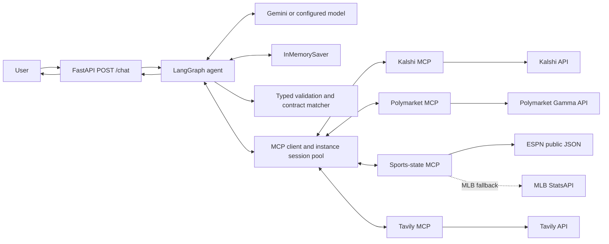
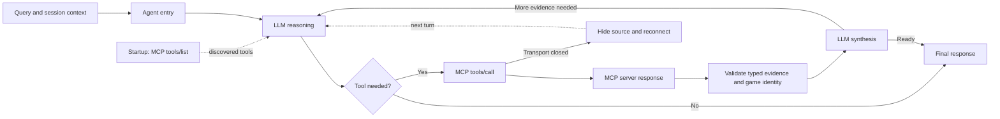
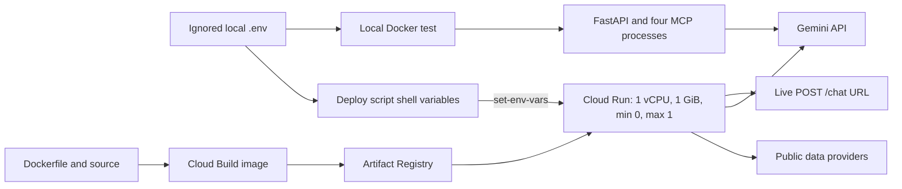

# SportsWatch MCP

Sports scores, prediction-market prices, and game news live in different systems. A team name
can retrieve plausible results, but does not establish that a score, two contracts, and an
article describe the same game. SportsWatch verifies the event before the agent combines those
sources in an answer.

The service follows MLB, NFL, and NCAA Division I football games across live state, box scores,
player statistics, play history, Kalshi, Polymarket, and current reporting. It keeps the game in
the conversation, so a follow-up can move from a score to a player or a contract without asking
the user to start over. It is read-only: no trades, account access, betting picks, or model-made
win probabilities.

## Evidence checks

1. **Event identity.** SportsWatch compares league, teams, date, scheduled start, and game number
   where available. Doubleheaders and similarly named matchups stay separate. Provider IDs remain
   in their own namespaces.
2. **Contract equivalence.** A deterministic matcher checks the named outcome, full-game
   scope, postponement window, cancellation payout, and complete supplied rules. It returns
   `equivalent`, `different`, or `ambiguous`. The model can explain that verdict but cannot
   promote an ambiguous pair into an equivalent one. A final sporting result does not establish
   prediction-market settlement.
3. **Source provenance.** Scores, quotes, and articles retain separate observation times. Tool
   output and search snippets are untrusted input; typed validation and game-identity checks run
   before the model uses them. Missing evidence is identified in the answer.

For example, a session can ask for a game score, then the last five plays, then both markets'
prices, then whether the contracts settle under the same terms. A narrow question uses only the
sources it needs. A full brief can chain calls across all four MCP servers.

## System design

Four independent MCP servers expose typed tools through real `tools/list` discovery and
`tools/call` invocation. These servers are written in this repository; the external services
provide data, not the MCP transport.

| Server | Why it exists |
| --- | --- |
| Sports-state MCP | Resolves an exact game, then returns state, box scores, player lines, and bounded play history. ESPN public JSON is primary; MLB StatsAPI is an MLB-only fallback. |
| Kalshi MCP | Finds sports contracts and returns provider-backed prices, rules, and settlement fields for an exact ticker. |
| Polymarket MCP | Finds Gamma sports markets and returns exact market detail by returned numeric ID. |
| Tavily MCP | Adds bounded, game-specific reporting after the game identity is established. |

LangGraph handles model-driven tool choice and session memory through `InMemorySaver`. The host
validates each tool result and computes market-to-market and market-to-game checks before final
synthesis. Independent calls in one reasoning step can run concurrently; a detail call waits for
the identifier returned by discovery. Each turn is capped at eight market or state calls and two
Tavily searches.

FastAPI discovers the four stdio servers concurrently when a container starts and reuses those
sessions across requests. A closed transport removes only that server from new turns and is
reconnected after active turns release it. Tool errors and malformed responses are handled per
call. There is no background keepalive.

The sports-state interface includes `sports_state_find_games`, `sports_state_get_game_state`,
`sports_state_get_box_score`, `sports_state_list_players`, `sports_state_get_player_stats`, and
`sports_state_get_play_by_play`. Market discovery and detail use `kalshi_search_markets`,
`kalshi_search_series`, `kalshi_get_market`, `polymarket_search_markets`, and
`polymarket_get_market`. Research uses `tavily_search_game_evidence`. Returned `game_ref`, player
IDs, market IDs, and tickers are opaque; callers pass them to detail tools unchanged.

### Data boundaries

- ESPN public JSON is undocumented and has no SLA. MLB StatsAPI is only a fallback for MLB after
  exact game checks; there is no substituted NFL or college football feed.
- A market price is a provider observation, not an independent forecast. Quote time and
  retrieval time are different clocks. Game completion does not imply contract settlement.
- Search snippets cannot prove a score, contract equivalence, or settlement rule. Truncated or
  differing rules leave a comparison `ambiguous` unless an explicit conflict proves it
  `different`.
- Matching currently covers supported full-game winner contracts. Spreads, totals, props,
  futures, and partial-game winners need different identity and settlement checks.

## Measured behavior

| Check | Observation |
| --- | --- |
| Warm Cloud Run no-tool chat | 13.54s before instance-owned MCP sessions; 2.09s after. One sample per revision. |
| First chat after scale-to-zero | 24.52s. Keeping zero minimum instances trades cold-start time for zero idle compute billing. |
| Four simultaneous no-tool chats | All returned HTTP 200 in 4.16–4.47s each. |
| Memory after startup and concurrent checks | About 374 MiB sampled against a 1 GiB limit; no OOM or 429 in 12 new-revision probes. |

These timings include network and Gemini time and are not a latency guarantee. The
[measurement report](docs/research/PERFORMANCE_VERIFICATION.md) records the queries, local stub
measurements, chained tool checks, memory sampling limits, and cost configuration. Tests also
kill a real MCP child process during a call, verify the other three servers remain usable, and
check that the failed server reconnects.

## Run locally

Requires Python 3.12+ and [uv](https://docs.astral.sh/uv/). The deployed model defaults to
Gemini 3.8 Flash at low reasoning effort. `OPENAI_API_KEY` and an OpenAI-compatible base URL are
available for local alternatives; a nonempty Gemini key takes precedence. `TAVILY_API_KEY` is
optional.

```powershell
uv sync --all-extras
Copy-Item .env.example .env
```

Set `GEMINI_API_KEY` in the ignored `.env`, then start the service:

```powershell
uv run python main.py
```

A local detour: [Kessel](https://github.com/waderylan/kessel) can run this agent through a
Codex or Claude Code login.

The API binds to `0.0.0.0` and reads `PORT` (default 8080). `POST /chat` takes `query` and
`session_id` and returns `response`:

```powershell
$body = @{ query = "What's the Yankees score?"; session_id = "demo-1" } | ConvertTo-Json
Invoke-RestMethod http://127.0.0.1:8080/chat -Method Post -ContentType application/json -Body $body
```

Reuse the session ID for follow-ups. `/chat/inspect` accepts the same body and adds bounded tool
activity; `/health` reports service health. Session IDs are not authentication. Memory lasts for
the running instance and is lost when Cloud Run scales to zero or replaces it.

An optional local browser workbench in `scripts/run_kessel_ui.py` provides editable game
questions and an activity trace. It is not part of the Cloud Run image.

### Verify

```powershell
uv run pytest -m "not live_smoke"
uv run ruff check .
uv run ruff format --check .
uv run mypy src
```

Recorded fixtures and scripted model decisions keep the default suite independent of paid
model calls. Opt-in provider and real-model checks live in `tests/live/`. The
[adversarial test report](docs/research/ADVERSARIAL_TESTING_REPORT.md) covers transport closure,
tool errors, invalid responses, and provider failures.

## Deploy and cost

The multi-stage Docker image uses locked Python dependencies, runs as a non-root user, and needs
no Node runtime. For a local container check:

```powershell
docker build -t sportswatch-mcp:local .
docker run --rm -p 8080:8080 --env-file .env sportswatch-mcp:local
```

With Google Cloud CLI authenticated and `GCP_PROJECT_ID` and `GEMINI_API_KEY` set in the ignored
`.env`, deploy with `bash deploy.sh YOUR_PROJECT_ID` on Bash or `.\deploy.ps1 -ProjectId YOUR_PROJECT_ID`
on PowerShell. The scripts build through Cloud Build, store the image in Artifact Registry, and
deploy one FastAPI worker to Cloud Run in `us-west1`. Runtime secrets are passed from the local
environment; they are not baked into the image. The live URL is stored only in ignored
`.cloud-run-url`.

The deployed service uses request-based billing, 1 vCPU, 1 GiB, concurrency 4, zero minimum
instances, and one maximum instance. It can scale to zero with no idle compute charge; no
process polls while idle. At the October 2026 Tier 1 list rates, active Cloud Run time is
$0.000024 per vCPU-second plus $0.0000025 per GiB-second, before the monthly free tier.
Startup and shutdown are billable time; request fees, image storage, builds, and network use
can add charges. [Cloud Run pricing](https://cloud.google.com/run/pricing)
has the current rates. Gemini 3.8 Flash was $0.75 per million input tokens and $3.75 per million
output tokens, including thinking tokens, through December 2026. A tool-using answer may make
several model calls. Check the [current Gemini pricing](https://ai.google.dev/gemini-api/docs/pricing)
and your key's billing tier. Public sports and market reads need no account key; keyed Tavily
searches have separate usage limits and possible charges.

## Architecture

### 1. System


```mermaid
flowchart LR
    U[User] --> API[FastAPI POST /chat]
    API --> G[LangGraph agent]
    G <--> L[Gemini or configured model]
    G <--> M[InMemorySaver]
    G --> V[Typed validation and contract matcher]
    G <--> C[MCP client and instance session pool]
    C <--> K[Kalshi MCP]
    C <--> P[Polymarket MCP]
    C <--> S[Sports-state MCP]
    C <--> T[Tavily MCP]
    K --> KA[Kalshi API]
    P --> PA[Polymarket Gamma API]
    S --> E[ESPN public JSON]
    S -. MLB fallback .-> B[MLB StatsAPI]
    T --> TA[Tavily API]
    G --> API
    API --> U
```

### 2. Tool invocation


```mermaid
flowchart LR
    D[Startup: MCP tools/list] -. discovered tools .-> R[LLM reasoning]
    Q[Query and session context] --> A[Agent entry]
    A --> R
    R --> X{Tool needed?}
    X -->|No| O[Final response]
    X -->|Yes| C[MCP tools/call]
    C --> S[MCP server response]
    C -->|Transport closed| F[Hide source and reconnect]
    F -. next turn .-> R
    S --> V[Validate typed evidence and game identity]
    V --> Y[LLM synthesis]
    Y -->|More evidence needed| R
    Y -->|Ready| O
```

### 3. Deployment


```mermaid
flowchart LR
    ENV[Ignored local .env] --> DEV[Local Docker test]
    DEV --> APP[FastAPI and four MCP processes]
    APP --> GEM[Gemini API]
    ENV --> SH[Deploy script shell variables]
    SRC[Dockerfile and source] --> BUILD[Cloud Build image]
    BUILD --> AR[Artifact Registry]
    AR --> CR[Cloud Run: 1 vCPU, 1 GiB, min 0, max 1]
    SH -->|set-env-vars| CR
    CR --> URL[Live POST /chat URL]
    CR --> GEM
    CR --> EXT[Public data providers]
```

## References

The four MCP servers are implemented here over [Kalshi](https://docs.kalshi.com/),
[Polymarket Gamma](https://docs.polymarket.com/market-data/overview),
[ESPN public JSON](docs/research/GAME_STATE_MCP.md),
[MLB StatsAPI](https://docs.statsapi.mlb.com/), and [Tavily](https://docs.tavily.com/).
Implementation notes cover [contract matching](docs/research/CONTRACT_MATCHING.md),
[sports-state design](docs/research/GAME_STATE_MCP.md), and
[research boundaries](docs/research/WEB_RESEARCH_MCP.md). Framework references:
[LangGraph](https://docs.langchain.com/oss/python/langgraph/overview),
[MCP Python SDK](https://github.com/modelcontextprotocol/python-sdk), and
[FastAPI](https://fastapi.tiangolo.com/).
