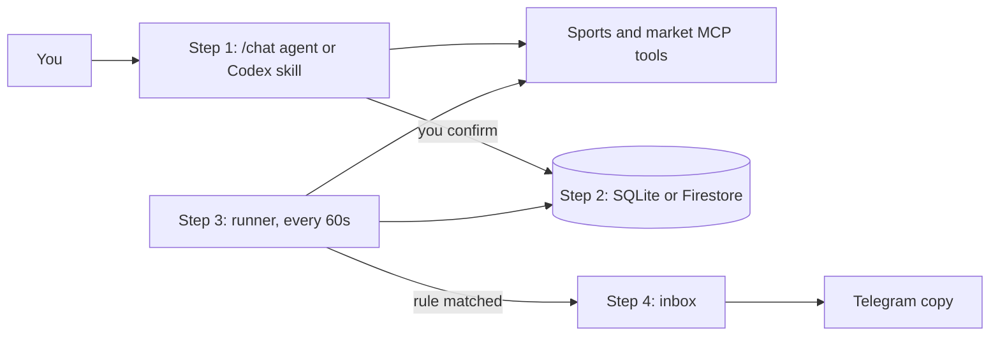

# Watches and Telegram alerts, explained

This doc explains the watch feature from zero. It assumes you know nothing about LangGraph, MCP,
prediction markets, schedulers, or delivery queues.

## 1. What a watch is

A watch is a saved rule, like:

> Text me if the Padres win chance moves 2+ points within 2 minutes.

Once it's saved, a background program checks the game and the markets every minute. When the rule
matches, it sends you an alert.

That's the whole feature. Everything below is detail about how each piece works and why it's built
that way.

## 2. The four jobs, and what does each one

The feature splits into four jobs. Each is handled by a different piece:

| Job | Who does it | Uses an AI model? |
|---|---|---|
| 1. You describe the rule in plain English | The LangGraph agent (`POST /chat`), **or** Codex / Claude Code with the `sports-information` skill | Yes |
| 2. The confirmed rule is saved | The database: SQLite (`artifacts/watches.db`) locally, Firestore in the cloud | No |
| 3. Every minute, the game and markets get checked | The runner: `scripts/run_watches.py` locally, Cloud Scheduler in the cloud | No |
| 4. You get told | The inbox (always) and Telegram (optional copy) | No |

**The AI is only used in step 1.** Steps 2 through 4 are plain Python. The model helps figure out
what you want. It never decides whether an alert fires.



### 2.1 The LangGraph agent (the assignment's chatbot on Cloud Run)

This is the chatbot that answers `POST /chat`. It answers ordinary questions without touching
watch code. For watches, it has eight extra tools it can call:

```text
watch_preview   watch_confirm   watch_list      watch_inspect
watch_pause     watch_resume    watch_delete    watch_inbox
```

You say "watch the Padres game for a 2-point move." The agent uses the MCP tools to find the exact
game and markets, shows you a preview, and saves the rule after you confirm.

It does **not** do the watching. The chat request ends as soon as the rule is saved.

### 2.2 The skill in Codex / Claude Code

`.agents/skills/sports-information` does the same step 1 (describe, preview, confirm), but with
Codex or Claude Code as the chat window instead of `/chat`. The coding agent reads the skill, uses
the same MCP tools, and drives `scripts/watch_cli.py` to preview and confirm the rule. It saves to
the same `artifacts/watches.db`.

It also doesn't do the watching.

**The `/chat` agent and the skill are two front doors to the same system.** The `/chat` agent is
what the assignment grades. The skill is a convenient local path for a developer.

### 2.3 The runner (the piece that actually watches)

Saving a watch does not start anything. Something has to wake up every minute and check. That's the
runner:

- **Locally:** `scripts/run_watches.py`, running in a terminal. If that terminal is closed, nothing
  gets checked. The saved watches stay in the database and resume when you start it again.
- **In the cloud:** Cloud Scheduler calls `POST /internal/watches/poll` on the Cloud Run service
  every minute. Each call does one check-and-send pass, then returns.

Each time it wakes up, the runner:

1. Loads the watches that are due from the database.
2. Calls the MCP tools for the current game state, recent plays, and Kalshi / Polymarket prices.
3. Compares them to earlier prices with plain math.
4. If a rule matches, saves an alert to the inbox and queues a Telegram message.
5. Sends any queued Telegram messages.

### 2.4 Telegram

Telegram is only a delivery channel: the thing that makes your phone buzz. It has no logic. When a
rule matches, the alert is saved to the inbox first, and then a copy goes to one Telegram chat
through a bot. If Telegram is down or not set up, the alert is still in the inbox.

### 2.5 One real alert, end to end

```text
You (in Codex)  --skill-->  watch_cli.py  --saves-->  watches.db
                                                          |
run_watches.py (terminal, every 60s) <--reads-------------+
      |--MCP--> ESPN score and plays, Kalshi price, Polymarket price
      |--math--> "moved 2+ pts in 2 min?" -> yes
      |--saves--> inbox
      +--sends--> Telegram bot --> your phone
```

In the cloud version, `/chat` replaces Codex, Firestore replaces `watches.db`, and Cloud Scheduler
replaces the terminal. Everything else is the same code.

## 3. Background: the base project

Skip this if you already know how the chatbot works.

### 3.1 The endpoint

```http
POST /chat
Content-Type: application/json

{ "query": "What is happening in the Yankees game?", "session_id": "demo-session" }
```

The response is `{ "response": "..." }`. `session_id` picks which conversation history to use, so a
follow-up like "show me its market prices" knows which game you meant.

A session ID is a routing key, not a password. Anyone who knows it can use that session. A real
multi-user product would need proper login in front of this.

### 3.2 How the agent thinks

LangGraph runs the conversation as a loop:

1. The model reads your question and the earlier messages.
2. It answers directly, or picks a tool.
3. The app runs the tool and validates the result.
4. The model reads the result.
5. It calls another tool, or writes the final answer.

Watch tools are just more tools in this loop. Ordinary questions never touch watch code.

Conversation memory (LangGraph's checkpointer) and the watch database are separate. Chat memory can
disappear when the app restarts. Saved watches live in SQLite or Firestore and survive restarts.

### 3.3 The four MCP servers

MCP (Model Context Protocol) is a standard way for the agent to find and call outside tools. The
project runs four MCP servers:

| MCP server | What it provides |
|---|---|
| `sports_state` | Finding games, score, game status, stats, and play-by-play |
| `kalshi` | Kalshi sports markets and exact contract prices |
| `polymarket` | Polymarket markets and exact contract prices |
| `tavily` | Web research about a game that's already been identified |

**The watch system is not a fifth MCP server.** MCP is how the app reaches *outside* data (ESPN,
Kalshi, Polymarket, the web). Watches are the app's own feature: its own database, rules, and
alerts. The watch tools are regular tools inside the app that the agent can call. Both the agent
and the runner get their outside data through the same four MCP servers.

## 4. Creating a watch (step 1 in detail)

### 4.1 Why your words aren't saved directly

Plain English is fuzzy:

- "Move eight percent" could mean 42% to 50% (8 points) or 42% to 45.36% (8% of 42).
- "Near a score" doesn't say how near.
- "The Yankees market" doesn't say which platform, contract, date, or game.

So the model never saves your words. It fills in a fixed form (a typed tool call), the app checks
that form, and only the checked fields are saved. Nothing the model writes in prose ever controls
what the runner does.

Moves are measured in **probability points**:

```text
before: 0.42  (42%)
after:  0.50  (50%)
move:   0.08  = 8 points
```

The check is inclusive: a rule set to 8 points fires at exactly 8.

### 4.2 Pinning the exact game and markets

Before a preview can exist, the app needs verified details for:

- one MLB, NFL, or NCAA Division I football game that hasn't ended;
- one to four Kalshi or Polymarket contracts that are still open;
- only "who wins the whole game" contracts;
- one exact team name (outcome) per contract;
- the same league, teams, and start time across the game and every contract.

The app rejects a market whose start time is more than 15 minutes off from the game's. It also
rejects spreads, totals, props, partial-game markets, futures, finished games, closed contracts,
made-up IDs, and team names that aren't in the contract.

That's why the agent asks you a question when something is ambiguous, like a doubleheader. A guess
here would make every later price comparison wrong.

### 4.3 Preview, then confirm

Creating a watch always takes two steps:

1. `watch_preview` builds a draft and gives it an ID like `draft_2f68...`.
2. `watch_confirm` saves it, but only when you confirm that exact draft ID.

The preview spells out everything: the game and start time, the exact market IDs and teams, every
threshold and time window, cooldown, delivery (inbox / Telegram), and when polling starts and stops.

Drafts live only in memory. A session has at most one pending draft; a new preview replaces the old
one. Drafts expire after 30 minutes and vanish if the app restarts. **Nothing is watched until you
confirm.**

Edits work the same way: the app builds a full new preview and changes the saved rule only after you
confirm. Pause, resume, inspect, list, delete, and inbox only work on watches owned by your session.

## 5. What the runner checks (step 3 in detail)

### 5.1 The three kinds of rules

**Price move.** Compares the current price to the earliest price within the window (e.g. 2
minutes). Up and down both count. Each price rule also picks how it relates to scoring:

- `any`: the price move alone is enough.
- `scoring_event`: only fire if a scoring play happened in the window.
- `no_tracked_scoring_event`: only fire if *no* scoring play showed up in the window. (This means
  the sports feed didn't report one. It doesn't prove nothing happened.)

**Platforms disagree.** Fires when Kalshi and Polymarket prices for the same team are at least N
points apart.

**Game status change.** Fires on a verified change like `live -> halftime` or `live -> final`.

### 5.2 How often it checks

| Game state | Checks every |
|---|---:|
| Starting 15 minutes before the scheduled start | 5 minutes |
| Scheduled, pregame, or delayed | 5 minutes |
| Live or halftime | 1 minute |
| First time the game and all contracts look finished | One more check 15 minutes later |
| Second finished check in a row | Watch stops |

"Finished" means the game is final or cancelled **and** every pinned contract is closed. If a data
source is down, the runner doesn't assume the game is delayed; it keeps the last confirmed pace.

"Within a minute" means within one check after the data providers publish it, not within a minute
of the play on TV. ESPN's feed usually lags the broadcast by seconds to a minute.

### 5.3 What one check does

1. Claims due watches with a 50-second lock, so two runners can't process the same watch at once.
2. Groups watches that point at the same game and markets, so shared data is fetched once.
3. Fetches that data through the `sports_state` MCP server plus whichever market servers are needed.
4. Saves the snapshot (a `WatchObservation`).
5. Evaluates every rule against recent snapshots.
6. If one matches, saves the alert and its Telegram job in one database transaction.
7. Schedules the next check, or stops the watch if the game is done.

No AI model and no Tavily web search is called during a check. If no watch is due, no MCP connection
is opened. When checks are due, it reuses one MCP session and handles at most two games at a time.

### 5.4 Four different clocks

| Clock | Meaning |
|---|---|
| Quote time | When the market says its price applies |
| Fetch time | When this app downloaded the data |
| Sports snapshot time | When ESPN says its game snapshot applies |
| Play time | When ESPN timestamps a play |

The runner uses the market's quote time when there is one, and fetch time only as a fallback.
Kalshi and Polymarket don't send quote times, which is why alerts include a note about it.
Play time is used for "did a scoring play happen in the window."

Keeping these separate stops a slow download from looking like earlier evidence. And lining up
timestamps shows two things happened close together; it **doesn't prove the play caused the
move**. Alerts say so.

### 5.5 Bad or missing data

Every data source is marked available, missing, stale, or malformed.

- A stale or missing price can't fire a price rule.
- A missing sports feed can't fire a scoring, no-scoring, or game-status rule.
- A scoring play with no timestamp is ignored for timing.
- A sports snapshot older than the rule's window can't back a scoring rule.
- A price is only compared with an *earlier* price inside the window; out-of-order data can't sneak
  in as the "before" price.
- The same scoring play reported twice counts once (matched by play ID).

The runner logs a warning and tries again next time. Missing data never turns into "yes, it
happened."

### 5.6 No alert spam

Three things stop repeat alerts:

1. **Fingerprint.** Each alert gets a fingerprint built from the watch, the rule, the evidence, the
   price changes, and the plays. The database accepts each fingerprint once.
2. **Cooldown.** After firing, the same rule stays quiet for its cooldown (5 minutes by default).
3. **Re-arm.** After firing, a rule is switched off until a verified check shows the move back under
   its re-arm level (or the game leaves the watched status). A data outage doesn't re-arm it.

### 5.7 Storage and restarts

The watch code talks to a storage interface, not to a specific database:

- **SQLite** is the full local version. Stop the runner, start it later, and it picks up from the
  same file.
- **Firestore** is the Cloud Run version. It uses transactions for claims, fingerprints, and
  Telegram jobs.

Snapshots are kept 7 days. Alerts and their evidence are kept 30 days. Watches stay until you delete
them. Cleanup runs in small batches.

## 6. Alerts and Telegram (step 4 in detail)

### 6.1 What an alert looks like

```text
MLB WATCH ALERT: San Diego Padres at Los Angeles Dodgers
San Diego Padres win chance moved fast (within 64s).

Kalshi: 36% -> 34% (down 2 pts)
Polymarket: 41.5% -> 36.5% (down 5 pts)

Plays in the last 3 min:
- 8:05 PM, 4th Inning: Bottom of the 4th inning
- 8:07 PM, 4th Inning: At bat now: Nick Pivetta pitching to Teoscar Hernandez, count 3-2 (pitches: BSFBBF)
Score: San Diego Padres 0, Los Angeles Dodgers 0 (4th Inning)

Your rule: 2+ pt move within 2 min, any cause.
Note: Kalshi and Polymarket did not report quote times, so fetch times were used.
Plays are timing context, not proof they caused the move.
Alert time: 8:08 PM PDT
```

Reading it top to bottom:

- **What moved:** each platform's before and after price, with direction and size.
- **What happened on the field:** up to five plays from the rule's window. Scoring plays are marked
  `SCORE:`. If no play fell in the window, the last play before it is shown instead.
- **Your rule**, in one sentence, so you know why it fired.
- **Notes** about data quality. The same note for several platforms is merged into one line.
- **Alert time** in the game's local timezone.

Plays come from a second play-by-play call on each check (`play_filter="all"`, last 50 plays).
They are display context only: if that call fails, the alert still fires.

**Baseball.** ESPN logs every pitch as a separate "play." The runner keeps completed at-bats,
mid-at-bat events (stolen bases, wild pitches), and the start of each half-inning. It drops
individual pitches, "X pitches to Y" lines, and middle/end-of-inning banners. If the latest batter
is still up, one "At bat now" line shows the count and every pitch as scorebook letters:
`B` ball, `S` called or swinging strike, `F` foul, `X` ball in play, `H` hit by pitch, `?` unknown.
The count is computed from those letters (a two-strike foul doesn't add a strike). The at-bat is
treated as over on ball in play, ball four, strike three, or an inning break.

**Football.** Every ESPN entry is a real play, so none are dropped. Each line shows the quarter and
game clock (`Q4 1:17`), the down, distance, and spot the play *started* from, and marks turnovers
`TURNOVER:`. Formation notes like `(Shotgun)` are removed. The provider records each play's
end-of-play situation, so the starting situation comes from the play before it. The first play in
the list has no earlier play to read from, so it's shown without down and distance.

```text
- 8:14 PM, Q4 1:28: 3rd & 10 at ATL 30: J.Love pass short left to M.Golden ran ob at ATL 10 for 20 yards (B.Bowman).
- 8:15 PM, Q4 1:18: TURNOVER: 2nd & 10 at ATL 10: J.Love pass short middle intended for J.Smith INTERCEPTED by X.Watts ...
```

Messages are capped at 1,500 characters. The inbox and Telegram get the exact same saved text.

### 6.2 Turning Telegram on

Telegram is opt-in per watch. The model can only switch it on or off. It can't choose where the
message goes.

The operator sets exactly one destination:

- `TELEGRAM_BOT_TOKEN`: from the git-ignored `.env` locally, or Google Secret Manager on Cloud Run.
- `TELEGRAM_CHAT_ID`: from the same external configuration.

Neither value ever appears in prompts, rules, MCP results, API responses, test fixtures, or
committed files.

If Telegram isn't configured, the watch keeps running and alerts still land in the inbox. The
Telegram job waits in a retryable `telegram_not_configured` state.

### 6.3 Why there's a queue (the "outbox")

Saving to a database and sending an HTTPS request can't happen as one all-or-nothing step:

- Send first, then save: a crash leaves a Telegram message with no record.
- Save first, send later without a queue: a crash between the two loses the message.

So the app uses an **outbox**:

```text
one database transaction:
    save the alert
    save its fingerprint
    save a pending Telegram job

separately, the delivery worker:
    locks a pending job (30-second lock)
    loads the saved alert
    sends its exact text
    marks it sent, retry later, or failed for good
```

A crash leaves the job in the database, and another worker picks it up when the lock expires.
Telegram's message ID is saved on success.

One honest limit: if the process dies *after* Telegram accepts a message but *before* the database
records it, the message can be sent twice. No design can promise exactly-once across two separate
systems, so this one doesn't claim to.

### 6.4 When Telegram fails

Requests time out after 5 seconds to connect and 10 seconds to read or write.

| Failure | What happens |
|---|---|
| Timeout or dropped connection | Retry with growing delays |
| HTTP 429 (rate limited) | Retry after Telegram's `retry_after`, within limits |
| HTTP 5xx | Retry with growing delays |
| Garbled success response | Retry |
| Bad token or persistent client error | Give up |
| You blocked the bot | Give up |
| Telegram not configured | Retry later; the inbox still has the alert |

Temporary failures give up after five attempts (`retry_exhausted`). Error records keep a short
category, never the token or raw URL.

## 7. Using it locally

### 7.1 Start the chatbot

```powershell
uv run python main.py
```

`POST /chat` handles both normal questions and watch management. For a browser UI instead:

```powershell
uv run python scripts/run_chat_ui.py
```

Open `http://127.0.0.1:3000`. The watch panel shows previews, confirmation, watch status, and the
inbox, using the same backend.

### 7.2 Start the runner in a second terminal

```powershell
uv run --env-file .env python scripts/run_watches.py --db artifacts/watches.db
```

- Keep **exactly one** runner open per database file.
- `state=idle` means nothing was due on that check. It's not an error; the next line should say
  `claimed=1` once a watch is due.
- Closing it stops checking. Saved watches stay on disk.
- After changing watch code, restart the runner. Python loads the code once at startup.
- On Windows, one runner shows up as two `python.exe` processes (the virtual-env launcher plus the
  real interpreter). That's normal.

### 7.3 Look at watches and alerts

```powershell
uv run --env-file .env python scripts/watch_cli.py --operation list --session-id demo-session
uv run --env-file .env python scripts/watch_cli.py --operation inbox --session-id demo-session --limit 10
uv run --env-file .env python scripts/watch_cli.py --operation inspect --session-id demo-session --watch-id <watch-id>
```

The CLI also takes JSON lines on standard input for preview and confirm. Keep the same CLI process
open between the two, because drafts only live in memory.

### 7.4 Offline demo

```powershell
uv run python scripts/run_watches.py --replay tests/fixtures/watch/yankees_scoring_replay.json
```

Replays a saved game with a temporary database and a fake Telegram. It shows an exact 8-point
match, the saved evidence, the inbox alert, duplicate suppression, and delivery, with no network or
credentials.

## 8. Where the code lives

| File | What it does |
|---|---|
| `src/market_agent/agent.py` | The LangGraph loop, watch instructions, and watch-tool routing |
| `src/market_agent/app.py` | `/chat` and the authenticated `/internal/watches/poll` route |
| `src/market_agent/watch/models.py` | Rule, snapshot, alert, and outbox schemas (all version 1) |
| `src/market_agent/watch/chat_tools.py` | The tools the model can call, plus exact-identity checks |
| `src/market_agent/watch/service.py` | Drafts, previews, confirmation, ownership, and management |
| `src/market_agent/watch/coordinator.py` | Claiming, MCP fetching, play filtering, check pace, stopping |
| `src/market_agent/watch/evaluator.py` | Rule matching, fingerprints, and alert text |
| `src/market_agent/watch/repository.py` | SQLite and Firestore storage, transactions, and locks |
| `src/market_agent/watch/delivery.py` | Telegram sending, timeouts, and retries |
| `src/market_agent/watch/runtime.py` | Wires storage, secrets, auth, runner, and delivery together |
| `scripts/watch_cli.py` | Local command-line management |
| `scripts/run_watches.py` | Local runner and the offline replay demo |
| `.agents/skills/sports-information/SKILL.md` | The Codex / Claude Code skill (step 1 via a coding agent) |

## 9. Safety rules

- The model asks for typed watch actions. It can't write to the database directly.
- The model can't pick a Telegram destination or see Telegram credentials.
- MCP results and contract text are treated as untrusted data and checked by the app.
- Public `/chat` and the internal scheduler route use separate authentication.
- Session ownership stops accidental cross-session changes, but it isn't user login.
- Watches only read public data and send informational alerts. They never place trades.
- Tavily web search is for questions you ask, never for routine checks.
- The runner never asks the model to explain an alert. You can ask afterward in chat, and the agent
  will load the saved alert, follow its evidence, and call the normal game, market, or Tavily tools.
  The saved alert never changes.

## 10. What's been proven, and what hasn't

**Proven locally, with real data:**

- Creating and confirming watches through the Codex skill and `watch_cli.py`.
- The SQLite runner polling a live MLB game through the real MCP servers.
- Real Telegram delivery: the opt-in live smoke test passed and real alerts arrived on a phone.

**Proven with automated tests and fakes:**

- The offline replay demo, rule matching, duplicate suppression, and retry/error handling.
- The Firestore storage adapter, Google OIDC check, and Secret Manager loading, each against a
  controlled stand-in.

**Not proven, because it needs cloud setup:**

- Watch tools running inside the deployed Cloud Run service.
- Firestore in production (indexes, permissions, concurrency, restart recovery).
- Cloud Scheduler calling `/internal/watches/poll`, with live OIDC and service-account permissions.
- Secret Manager supplying the Telegram token on Cloud Run.

None of the cloud pieces above are claimed as working live.
