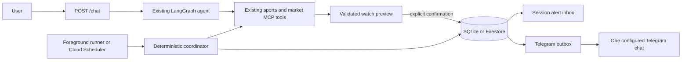

# Event-aware watches and Telegram alerts

This document explains the project and the watch feature from first principles. It assumes no
knowledge of LangGraph, MCP, prediction markets, schedulers, or delivery queues.

## 1. The product in one sentence

Market Lens answers questions about a specific sports game and its full-game-winner prediction
markets, then lets a user save an exact monitoring rule that creates an inbox alert and optionally
sends the same alert to Telegram.

The shortest useful mental model is:

```text
chat defines the rule -> a runner checks evidence -> deterministic code decides -> inbox stores
the alert -> Telegram optionally receives a copy
```

The language model helps understand what the user wants. It does not decide whether a saved rule
fires.



The watch service is host-application code, not a fifth MCP server. MCP remains the boundary for
external sports and market evidence.

## 2. The base project

### 2.1 The public interface

The main interface is one HTTP endpoint:

```http
POST /chat
Content-Type: application/json

{
  "query": "What is happening in the Yankees game?",
  "session_id": "demo-session"
}
```

The response keeps the assignment contract:

```json
{
  "response": "..."
}
```

`session_id` tells LangGraph which conversation history to use. Reusing the same value lets a
follow-up such as "show me its market prices" refer to the game selected in the prior turn.

A session ID is a routing key, not a password. Anyone who knows it can address that session. A
production multi-user service needs real authentication in front of this design.

### 2.2 LangGraph and the model

LangGraph runs the conversation as a loop:

1. The model reads the current question and earlier messages in the session.
2. It either answers directly or selects a tool.
3. The application executes the tool and validates the result.
4. The model reads the validated result.
5. It can call another tool or produce the final answer.

Simple questions still work. The watch feature adds tools to this loop; it does not replace the
loop or force ordinary questions through watch code.

LangGraph's in-process checkpointer stores conversation messages. That memory is separate from the
watch database. Conversation memory can disappear when the application process stops. Confirmed
watches use SQLite or Firestore and are designed to survive process restarts.

### 2.3 MCP and the four evidence servers

MCP, the Model Context Protocol, gives the agent a standard way to discover and call external
tools. The project runs four MCP servers:

| MCP server | What it provides |
|---|---|
| `sports_state` | Game discovery, score, lifecycle, statistics, and scoring plays |
| `kalshi` | Kalshi sports-market discovery and exact contract details |
| `polymarket` | Polymarket discovery and exact contract details |
| `tavily` | Bounded web research tied to an already identified game |

The agent never invents opaque identifiers. It first discovers candidates, then retrieves an
exact game or market using the identifier returned by the provider.

For example, "the Yankees game" can be ambiguous because there may be no game, one game, or two
games in a doubleheader. The agent uses sports discovery to identify the scheduled start, home
team, away team, league, and `game_ref`. It uses separate market discovery to obtain the real
Kalshi ticker or Polymarket market ID.

## 3. What Milestone 15 adds

Milestone 15 turns a conversational request into a durable, event-aware watch.

A watch is not a model prompt that runs forever. It is a validated data object plus deterministic
evaluation code.

Example request:

> Watch the Yankees game. Alert me if either market moves at least eight points within two minutes
> of a scoring play, or twelve points when no scoring play is recorded.

The feature performs five distinct jobs:

1. Interpret and clarify the request.
2. Resolve the exact game, contracts, and outcomes through the existing MCP servers.
3. Compile the request into a typed `WatchRule`.
4. Show an exact preview and wait for confirmation.
5. Poll evidence and evaluate the confirmed rule without a model.

### 3.1 Why natural language is not stored as executable configuration

Natural language can be incomplete or ambiguous. "Move eight percent" might mean an eight-point
move from 42% to 50%, or a relative 8% increase from 42% to 45.36%. "Near a score" does not define
a time window. "Yankees market" does not identify a platform, contract, outcome, date, or game.

The model therefore produces arguments for a bounded host tool. Pydantic validates those
arguments and the host performs additional identity checks. Only typed fields reach the evaluator.
Free-form model prose never becomes a polling instruction.

This project defines price movement in probability points:

```text
before price: 0.42
after price:  0.50
absolute move: 0.08 = 8 probability points
```

The threshold comparison is inclusive. A rule set to eight points fires at exactly `0.08` when
the remaining conditions also match.

### 3.2 Exact identity resolution

Before a preview can exist, the current chat turn must contain validated detail for every identity:

- one non-terminal MLB, NFL, or NCAA Division I football game;
- one to four non-terminal Kalshi or Polymarket contracts;
- only full-game-winner contracts;
- one exact named outcome for each contract;
- matching league, teams, and scheduled start between the game and each contract.

The host rejects a market whose scheduled start differs from the game by more than 15 minutes. It
also rejects spreads, totals, props, partial-game markets, futures, terminal games, terminal
contracts, constructed IDs, and outcomes that do not appear in the retrieved contract detail.

This is why the agent asks questions when an alias or doubleheader is ambiguous. Guessing would
make every later price comparison unsafe.

### 3.3 The confirmation boundary

Creation uses two steps:

1. `watch_preview` creates an in-memory draft and returns a generated `draft_id`.
2. `watch_confirm` persists the rule only when the user explicitly confirms that exact draft.

The preview lists:

- the exact game and scheduled start;
- the pinned market IDs and named outcomes;
- every threshold, evaluation window, event relationship, cooldown, and re-arm rule;
- inbox and Telegram delivery choices;
- polling and stop behavior.

One session has at most one pending preview. A later preview replaces its older pending preview.
Drafts expire after 30 minutes and do not survive an application restart. No unconfirmed draft is
an active watch.

A revision follows the same safety boundary. The service builds a full replacement preview and
changes the stored rule only after confirmation. Pause, resume, inspect, list, delete, and inbox
operations act only on watches owned by the supplied session ID.

### 3.4 The canonical data objects

| Object | Purpose | Important contents |
|---|---|---|
| `WatchRule` | The confirmed instruction | Exact game, exact markets, typed conditions, delivery policy, owner session, schema version |
| `WatchObservation` | One synchronized polling snapshot | Game lifecycle, scoring plays, market quotes, source states, separate timestamps |
| `WatchTrigger` | An immutable alert decision | Matched condition, bounded before/after deltas, evidence IDs, warnings, message, fingerprint |
| `OutboxItem` | Telegram delivery work | Trigger reference, retry status, attempt count, lease, provider message ID |

Every persisted contract has schema version `1`. Unknown versions fail validation instead of being
silently interpreted with the wrong semantics.

### 3.5 Supported conditions

#### Price movement

The evaluator compares a current usable quote with the earliest usable quote inside the configured
rolling window. It uses the absolute difference, so both upward and downward moves can match.

A price-movement rule chooses one event relationship:

- `scoring_event`: at least one normalized scoring play appears inside the correlation window.
- `no_tracked_scoring_event`: no new normalized scoring play appears inside that window.
- `any`: price movement is enough; no sports-event relationship is required.

`no_tracked_scoring_event` does not mean "nothing happened." It means only that the sports source
did not provide a new normalized scoring play in that exact window.

#### Cross-platform divergence

The evaluator compares current usable prices for the same named outcome on at least two platforms.
The rule matches when the highest price minus the lowest price reaches the configured point
threshold.

#### Lifecycle change

The evaluator detects a verified transition such as `live -> halftime`, `halftime -> live`, or
`live -> final`. The rule lists the target states that matter.

### 3.6 Four different clocks

The feature keeps these timestamps separate:

| Clock | Meaning |
|---|---|
| Quote time | When the market provider says the quote applies |
| Retrieval time | When Market Lens fetched the evidence |
| Sports observation time | When the sports provider says its game snapshot applies |
| Play time | When the sports feed timestamps a scoring play |

The evaluator uses quote time when available and retrieval time only as its fallback. It uses play
time for event correlation. Keeping these clocks separate prevents a request that arrived late
from looking like evidence that existed earlier.

Timestamp alignment is correlation, not causation. The alert states this explicitly. Market Lens
can show that a price move and a scoring play appear close together in provider data; it cannot
prove that the play caused the move.

### 3.7 Polling without a model

The polling coordinator is ordinary Python code. It makes zero language-model calls and zero
Tavily calls.

One polling cycle performs these steps:

1. Atomically claim due active watches with a 50-second lease.
2. Group watches that pin the same game and the same market identities.
3. Fetch one shared observation for each compatible group.
4. Use only `sports_state` and the market MCP servers required by that group.
5. Store the observation for each watch.
6. Evaluate every typed condition against recent history.
7. Atomically store any trigger and its Telegram outbox item.
8. Schedule the next check or mark the watch terminal.

The coordinator opens no MCP connection when no watch is due. Within a due cycle it reuses one MCP
session and observes at most two independent game groups concurrently. Sharing observations avoids
duplicating provider work when several rules watch the same exact evidence.

Polling cadence is:

| Game state | Interval |
|---|---:|
| Before the game, starting 15 minutes before scheduled start | 5 minutes |
| Scheduled, pregame, or delayed | 5 minutes |
| Live or halftime | 1 minute |
| First fully terminal observation | Final confirmation poll 15 minutes later |
| Second consecutive fully terminal observation | Stop the watch |

"Fully terminal" means the game is final or cancelled and every pinned contract is terminal. An
outage does not make the coordinator assume the game is delayed or slow an active game's cadence;
it uses the last verified lifecycle when scheduling the retry.

Alert timing means within one polling cycle after the providers expose usable evidence. It is not a
promise measured from the real-world play.

### 3.8 Missing, stale, malformed, and out-of-order evidence

Every source is classified as available, missing, stale, or malformed.

- A stale or unavailable quote cannot fire its price condition.
- An unavailable sports feed cannot fire a scoring, no-scoring, or lifecycle condition.
- A scoring play without a provider play time is excluded from correlation.
- An old sports snapshot cannot support an event relationship when it is older than the rule's
  correlation window.
- A current quote is compared only with an earlier quote whose clock falls inside the rolling
  window. Out-of-order quotes cannot become the "before" side of a later comparison.
- Repeated scoring plays are deduplicated by provider play ID.

The coordinator stores a warning and retries. It does not turn missing evidence into a positive
claim.

### 3.9 Duplicate suppression, cooldown, and re-arm

Three mechanisms prevent alert storms:

1. A stable fingerprint represents the watch, condition, evidence IDs, price deltas, event IDs,
   and lifecycle transition. The repository accepts a fingerprint only once.
2. A cooldown blocks another alert from the same condition for its configured duration.
3. A fired condition becomes disarmed. It re-arms only after verified evidence falls below its
   re-arm level, or after a lifecycle leaves the watched target state.

Source outages do not re-arm a condition because they provide no verified metric.

### 3.10 Persistence and restarts

The watch logic depends on a repository interface rather than a storage-specific API.

- SQLite is the complete local implementation. A foreground runner can stop and later continue
  from the same database file.
- Firestore is the Cloud Run implementation. It uses document transactions for claims, trigger
  fingerprints, and outbox writes.

Leases allow overlapping scheduler requests without intentionally processing the same watch or
outbox item at the same time. Stable fingerprints make a repeated evaluation a logical duplicate
rather than a second alert.

Ordinary observations are retained for seven days. Trigger evidence and triggers are retained for
30 days. Watch definitions remain until deleted. Cleanup work is bounded so one cycle does not
attempt an oversized Firestore transaction.

## 4. What Milestone 16 adds

Milestone 16 projects stored triggers to Telegram. It does not alter trigger evaluation.

The inbox is always enabled and remains the authoritative alert record. Telegram is optional per
watch and acts as an external copy.

### 4.1 Explicit opt-in and one destination

A user must request Telegram for each watch. The model can set only a Boolean opt-in. It cannot
supply a chat ID.

The deployment operator configures exactly one Telegram chat using:

- `TELEGRAM_BOT_TOKEN`, loaded from ignored local environment configuration or Google Secret
  Manager in Cloud Run;
- `TELEGRAM_CHAT_ID`, loaded from external configuration.

Neither value appears in prompts, rules, MCP results, API responses, fixtures, snapshots, or
committed files.

If Telegram is not configured, the watch remains active and inbox alerts continue. Its Telegram
outbox item records a retryable `telegram_not_configured` state.

### 4.2 Why the outbox exists

A database write and an HTTPS request cannot be one atomic operation. Sending first risks a
Telegram message with no stored trigger. Storing first without a queue risks losing delivery when
the process crashes between the two operations.

The transactional outbox solves this:

```text
one database transaction:
    save trigger
    save unique fingerprint
    save pending outbox item

separate delivery worker:
    lease outbox item
    load stored trigger
    send exact stored message
    mark sent, retry, or terminal failure
```

A crash leaves recoverable database state. A 30-second delivery lease allows another worker to
recover abandoned work. The provider message ID is stored after success.

This provides exactly-once logical delivery work inside the application. Telegram's HTTP API does
not provide a transaction shared with the database, so a process failure after Telegram accepts a
message but before the database records success can still produce a repeated external message.
The design does not claim an impossible cross-system exactly-once guarantee.

### 4.3 Retry behavior

Telegram requests use bounded HTTPS timeouts: five seconds to connect or obtain a pool slot, and
ten seconds to read or write.

| Failure | Result |
|---|---|
| Timeout or disconnect | Bounded exponential retry |
| HTTP 429 | Retry using Telegram's bounded `retry_after` when present |
| HTTP 5xx | Bounded exponential retry |
| Malformed success response | Bounded retry |
| Invalid authorization or persistent client error | Terminal delivery failure |
| Bot blocked by recipient | Terminal delivery failure |
| Missing local configuration | Retry later; inbox remains available |

Transient delivery stops after five attempts and records `retry_exhausted`. Error records contain
sanitized classifications, not credentials or raw URLs.

### 4.4 Alert contents

Each message is limited to 1,500 characters and includes:

- exact league, matchup, and scheduled start;
- platform, market ID, and outcome;
- before and after price;
- actual and configured evaluation windows;
- correlated scoring or lifecycle evidence;
- freshness or missing-source warnings;
- trigger time;
- the statement that timing alignment does not prove causation.

The inbox and Telegram use the same stored `WatchTrigger.message`, so delivery cannot reinterpret
the evidence.

## 5. How the chat endpoint and background runner fit together

The feature is available through the existing `POST /chat` endpoint. Application startup builds a
watch runtime and injects its `WatchService` into the existing `ChatAgent`. That causes LangGraph to
see eight additional host tools:

```text
watch_preview   watch_confirm   watch_list      watch_inspect
watch_pause     watch_resume    watch_delete    watch_inbox
```

The HTTP request and response shapes do not change. Ordinary chat and watch management share the
same conversation interface.

Recurring work is intentionally separate:

- Local development runs `scripts/run_watches.py` in a foreground process.
- Cloud Run exposes `POST /internal/watches/poll` for Cloud Scheduler.
- The internal endpoint requires a configured Google OIDC audience and scheduler service account.
- The internal endpoint runs one polling cycle and one delivery cycle.

The public chat request does not remain open to monitor a game. Creating a watch through `/chat`
does not itself start a local background process. The local runner must be active, or Cloud
Scheduler must invoke the internal endpoint in deployment.

This split has three practical benefits:

- chat stays responsive;
- polling continues without conversational model calls;
- scheduler authentication remains separate from public chat access.

## 6. Complete example

### Turn 1: request

```text
User: Watch the Yankees game. Alert me if either market moves at least eight points
within two minutes of a scoring play, or twelve points when no scoring play is recorded.
Include Telegram.
```

### Turn 2: clarification when needed

```text
Agent: There are two Yankees games on that date. Do you mean the 1:05 PM or 7:05 PM game?
```

The agent also asks when platform, outcome, threshold, window, or event relationship is missing or
contradictory.

### Tool resolution

The agent resolves the selected game with sports discovery and exact game state. It separately
discovers and retrieves each Kalshi or Polymarket contract. The host verifies that all identities
refer to the same full game and named outcome.

### Preview

The agent returns a preview equivalent to:

```text
Game: Tampa Bay Rays at New York Yankees - 2026-09-24T19:05:00-04:00
Contracts: kalshi <exact ticker> (New York Yankees); polymarket <exact ID> (New York Yankees)
Triggers:
- 8 probability points within 120s with a scoring event in the 120s correlation window
- 12 probability points within 120s with no tracked scoring event in that window
Delivery: inbox, telegram
Polling: 5m before/delayed, 1m live, final confirmation poll, zero model/Tavily calls
Confirm: confirm draft_<generated ID>
```

No rule exists in durable storage at this point.

### Confirmation

```text
User: confirm draft_<generated ID>
```

The host retrieves that draft from the same session, validates it again, creates a versioned
`WatchRule`, and writes it to the configured repository.

### Polling and trigger

Assume a usable quote moves from `0.42` to `0.50` in 119 seconds and the sports feed contains a
new scoring play in the configured correlation window.

- The absolute movement is exactly eight points, so it reaches the inclusive threshold.
- The scoring relationship matches.
- The condition is armed and outside its cooldown.
- The repository has not seen the generated fingerprint.
- One `WatchTrigger` and one Telegram outbox item are committed atomically.

The alert immediately appears in the session's inbox. The delivery worker sends the same message
to the configured Telegram chat. If Telegram fails, the inbox record remains available and the
outbox follows its retry policy.

## 7. Local use

### Start chat

```powershell
uv run python main.py
```

Use `POST /chat` for both ordinary questions and watch management.

To use the browser interface instead, run:

```powershell
uv run python scripts/run_chat_ui.py
```

Open `http://127.0.0.1:3000`. The watch center exposes preview confirmation, watch status, and the
trigger inbox while using the same FastAPI, LangGraph, validation, and repository paths.

### Run polling in a second terminal

```powershell
uv run python scripts/run_watches.py --db artifacts/watches.db
```

Stopping this process stops local polling. The SQLite data remains on disk.

### Inspect through the typed CLI

```powershell
uv run python scripts/watch_cli.py --operation list --session-id demo-session
uv run python scripts/watch_cli.py --operation inbox --session-id demo-session --limit 10
uv run python scripts/watch_cli.py --operation inspect --session-id demo-session --watch-id <watch-id>
```

The CLI also accepts JSON objects on standard input for preview and confirmation. Keep that CLI
process open between those two operations because pending drafts are in memory.

### Run the deterministic demonstration

```powershell
uv run python scripts/run_watches.py --replay tests/fixtures/watch/yankees_scoring_replay.json
```

This command uses a historical fixture, temporary SQLite database, and fake Telegram transport. It
demonstrates an exact threshold match, stored evidence, inbox alert, duplicate suppression, and
delivery without using external services or credentials.

## 8. Code map

| File | Responsibility |
|---|---|
| `src/market_agent/agent.py` | Existing LangGraph loop, watch prompt, and watch-tool routing |
| `src/market_agent/app.py` | Public chat routes and authenticated internal polling route |
| `src/market_agent/watch/models.py` | Versioned rules, observations, triggers, and outbox schemas |
| `src/market_agent/watch/chat_tools.py` | Model-facing typed commands and exact-identity checks |
| `src/market_agent/watch/service.py` | Drafts, previews, confirmation, ownership, and management |
| `src/market_agent/watch/coordinator.py` | Claims, MCP observation grouping, cadence, and lifecycle |
| `src/market_agent/watch/evaluator.py` | Deterministic matching, fingerprints, and alert rendering |
| `src/market_agent/watch/repository.py` | SQLite and Firestore persistence, transactions, and leases |
| `src/market_agent/watch/delivery.py` | Telegram adapter, timeout policy, retries, and terminal errors |
| `src/market_agent/watch/runtime.py` | Storage, secrets, OIDC, coordinator, and delivery composition |
| `scripts/watch_cli.py` | Bounded local management interface |
| `scripts/run_watches.py` | Foreground poller and credential-free replay demonstration |

## 9. Security and trust boundaries

- The model can request typed watch actions but cannot write the repository directly.
- The model cannot choose a Telegram destination or read Telegram credentials.
- MCP results and contract rules are untrusted data and pass through host validation.
- Public `/chat` and internal scheduler authentication are separate boundaries.
- Session ownership prevents accidental cross-session operations but is not user authentication.
- Watches read public evidence and send informational alerts. They never place orders.
- Tavily is available for user-requested investigation, not routine polling.
- Automatic model explanations are disabled. A user can request a bounded investigation after an
  alert.

An investigation is a normal foreground chat turn. The agent loads the stored trigger, follows its
bounded evidence references, and can call the ordinary game, market, or Tavily tools for additional
context. The saved trigger does not change, and routine polling never launches an investigation.

## 10. What is verified and what still requires deployment

The repository verifies the complete local SQLite flow, deterministic replay, fake Telegram
delivery, retry/error behavior, Firestore adapter behavior through fakes, OIDC verification through
controlled substitutes, and Secret Manager boundaries through controlled substitutes.

These boundaries require external setup before live acceptance:

- Cloud Run deployment and persistence across real instance replacement;
- production Firestore indexes, contention, permissions, and restart recovery;
- Cloud Scheduler invocation of the internal endpoint;
- live Google OIDC validation and service-account permissions;
- live Secret Manager access;
- a Telegram bot token and deployment-owned chat ID;
- the opt-in live Telegram smoke test.

Local verification does not claim that these cloud services or Telegram worked live.
