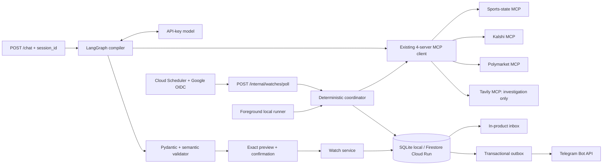

# Watch monitoring and alerts

## Product boundary

Market Lens compiles a conversational request into one versioned `WatchRule`, presents the exact
game, contracts, outcomes, thresholds, windows, and delivery policy, and activates the rule only
after explicit confirmation. The initial scope is MLB, NFL, and NCAA Division I football
full-game-winner contracts on Kalshi, Polymarket, or both.

Watches observe public evidence and create informational alerts. They do not place trades,
calculate a proprietary win probability, or treat timestamp alignment as proof that a game event
caused a market move. `no_tracked_scoring_event` means that no new normalized scoring play appears
in the configured correlation window; it never means that nothing happened.

## Architecture and boundaries



The four MCP servers remain the only external evidence boundary. Watch state, validation,
evaluation, leases, trigger fingerprints, retention, inbox records, and delivery state remain in
host application services. Polling never invokes provider clients directly. Each invocation opens
only `sports_state` plus the market platforms pinned by the claimed groups, reuses that bounded MCP
session across its game groups, and collects at most two independent groups concurrently. Empty
polling cycles do not open evidence sessions. The Tavily MCP server is not started in the polling
path.

## Natural-language intent compilation

The LangGraph system prompt and bounded host tools recognize create, confirm, list, inspect,
revise, pause, resume, delete, inbox, and investigate intents. The model clarifies ambiguous team
aliases, doubleheaders, platforms, outcomes, thresholds, windows, and scoring relationships. It
uses `sports_state_find_games` followed by exact game detail and uses platform discovery followed
by exact market detail.

The `watch_preview` host command accepts only identifiers present in typed detail observations from
the current graph turn. Host validation checks league, both participants, scheduled-start
alignment, `game_winner` type, platform namespace, and named outcome. The model cannot construct or
persist a `game_ref`, ticker, Gamma market ID, team mapping, date, or polling interval. A preview is
an in-process draft, not an active rule. `watch_confirm` accepts the exact draft ID in the creating
session and performs the first durable write. The web client exposes a confirm action only when an
assistant response contains exactly one valid preview draft ID, so the safe exact-ID handshake does
not require retyping it. Each session holds at most one pending preview, previews expire after 30
minutes, and the process-wide draft cache is bounded.

The repository skill follows the same identity order. `scripts/watch_cli.py` accepts one JSON
object per line and keeps preview drafts in its foreground process. Local Codex does not claim
LangGraph checkpoint behavior and does not remain active when its session or foreground runner
exits. Safe typed arguments cover list, inspect, pause, resume, delete, and inbox operations; that
surface has no Telegram credential or destination argument.

## Canonical schemas

`WatchRule` version 1 contains an unguessable watch ID, creating session, exact `GameIdentity`, one
to four exact `MarketIdentity` records, discriminated typed conditions, lifecycle, fixed polling
policy, and allowlisted delivery channels. Thresholds are decimal probability points: `0.08`
means eight points.

`WatchObservation` keeps these clocks distinct:

| Clock | Meaning |
|---|---|
| `quote_time` | Provider quote clock when authoritative |
| quote `retrieved_at` | Time the market tool returns the quote |
| `sports_observed_at` | Provider sports-state observation clock |
| `play_time` | Normalized scoring-play wall clock |
| observation `retrieved_at` | Coordinator collection time |

It also carries provider observation IDs, cache flags, source status, lifecycle, normalized prices,
and bounded scoring plays. `WatchTrigger` contains bounded deltas, correlated events, lifecycle
changes, source warnings, evidence IDs, a stable SHA-256 fingerprint, and a deterministic message
under 1,500 characters. `OutboxItem` tracks one logical Telegram projection through pending,
leased, retry, sent, and terminal-failure states. Schema versions other than 1 fail safely.

## Deterministic polling and trigger semantics

The coordinator claims due rules with a 50-second lease and groups rules by exact `game_ref` plus
platform, market ID, and named outcome. One MCP observation set serves every compatible rule. It
polls active or halftime games once per minute, scheduled or delayed games once per five minutes,
and performs a final poll 15 minutes after the game and every referenced contract are terminal.

Price conditions compare quote clocks when present and retrieval clocks otherwise. A threshold is
inclusive, so `0.42` to `0.50` meets an eight-point rule. Scoring relationships inspect unique
normalized play IDs inside the configured correlation window. Cross-platform divergence requires
both sources. Lifecycle conditions require an observed transition. A required missing, stale, or
malformed source blocks that source-dependent trigger, stores a warning, and leaves the watch due
for retry.

Edge state is durable per condition. A trigger fires only when the condition is armed, the cooldown
allows it, and the rule crosses its typed condition. A false observation rearms it according to
`rearm_below`. The fingerprint includes watch, condition, evidence IDs, deltas, event IDs, and
lifecycle transition. Unique storage constraints suppress duplicate logical triggers across
restarts and concurrent requests.

Ordinary observations remain for seven days. Evidence linked to a trigger remains with that
trigger for 30 days. Watch definitions remain until session-scoped deletion. Cleanup is explicit in
both repositories instead of relying on Firestore TTL billing.

## Token and provider-cost controls

- A model compiles or revises intent and synthesizes conversational responses.
- Routine polling performs zero model calls, zero Tavily server starts, and zero Tavily calls.
- Telegram success, retry, and failure perform zero model calls.
- Compatible watches share one observation set.
- Due game groups share one set of required MCP subprocess sessions per polling invocation.
- Retention cleanup runs at most hourly per warm coordinator instead of scanning on every poll.
- Automatic model explanations are disabled; a user requests a bounded investigation.
- Polling stores normalized deltas and evidence references instead of unbounded provider payloads.

The cadence matches the conservative initial policy. Public APIs have no contractual latency or
availability guarantee, so alerts promise delivery within one polling cycle after providers expose
the relevant evidence, not relative to the real-world event.

## SQLite and Firestore

SQLite is the complete local implementation. Immediate write transactions, foreign keys, WAL,
bounded leases, unique fingerprints, and a trigger/outbox transaction cover restart and concurrent
runner behavior. `scripts/run_watches.py` is an explicit foreground process; stopping it stops
polling while preserving rules.

Firestore implements the same repository interface. Transaction callbacks claim watches and
outbox records and atomically commit trigger, fingerprint, evidence, and delivery records. The
adapter stores versioned model JSON while keeping query and lease fields indexed at the document
level. A controlled in-memory substitute verifies transaction and restart behavior locally.
Cloud Run persistence and real Firestore behavior remain unverified until deployment.

## Cloud Run scheduler and OIDC

The public assignment contract remains `POST /chat`. `POST /internal/watches/poll` is a separate
internal boundary. It rejects requests unless a Google-signed OIDC token has the configured
audience, the dedicated Scheduler service-account email, verified email, and Google issuer.
Cloud Scheduler targets the full service URL as its audience and calls the endpoint once per
minute; the coordinator returns without provider work when no rule is due.

The implementation follows Google Cloud's official guidance for
[Cloud Scheduler to Cloud Run](https://cloud.google.com/run/docs/triggering/using-scheduler) and
[service-to-service OIDC](https://cloud.google.com/run/docs/authenticating/service-to-service).
Local controlled claims verify the application boundary. Cloud Scheduler and Google-issued token
acceptance remain unverified until deployment.

## Telegram outbox and retry model

Telegram is the only external channel. Inbox delivery is mandatory and authoritative. A watch must
explicitly add `telegram`; no model, chat request, rule, fixture, or API response accepts a chat ID.
The deployment owns one configured recipient.

The trigger and one outbox record commit atomically. A 30-second lease prevents two workers from
claiming the same logical message. HTTPS uses 5-second connection/pool and 10-second read/write
timeouts. Telegram `429` responses honor bounded `retry_after`; timeouts, disconnects, malformed
success bodies, and `5xx` responses use bounded exponential retry. Persistent client,
authorization, and blocked-recipient errors become terminal and visible beside the inbox alert.
Missing configuration schedules inbox-first fallback and never disables the watch.

Telegram's [Bot API](https://core.telegram.org/bots/api) permits messages longer than this product
uses; Market Lens enforces its own 1,500-character ceiling. The alert names the exact game,
platform, contract, outcome, before/after price, evaluation window, correlated scoring or lifecycle
event, freshness/source warning, trigger time, and non-causation notice.

## Security and secrets

- `TELEGRAM_BOT_TOKEN` is a `SecretStr` from ignored local environment configuration.
- Cloud Run can set `TELEGRAM_BOT_TOKEN_SECRET`; the service reads the latest value through Google
  Secret Manager and Application Default Credentials.
- `TELEGRAM_CHAT_ID` is external configuration and remains a `SecretStr`.
- Errors store only bounded classifications such as `rate_limited`, `server_error`,
  `recipient_blocked`, or `telegram_not_configured`.
- Tokens and recipient IDs never enter URLs in logged exceptions, prompts, rules, MCP output,
  snapshots, or committed files.
- Session IDs scope data but are not authentication. The release is single-owner and does not
  expose private multi-user watch history.

The Secret Manager boundary follows the official
[Python client guidance](https://cloud.google.com/secret-manager/docs/reference/libraries).

## Adversarial verification and measured result

The deterministic fixture `tests/fixtures/watch/yankees_scoring_replay.json` contains synchronized
market and scoring evidence. The foreground replay command reports two observations, zero baseline
triggers, one exact eight-point boundary trigger, one inbox alert, one fake Telegram projection,
zero model calls, and zero Tavily calls.

Five consecutive credential-free replay runs on the local Windows development environment report
104-118 ms for three coordinator polls, with a 108 ms median. Each run retains two unique
observations, creates one threshold trigger, creates zero triggers on the duplicate poll, and
projects one fake Telegram delivery. The fixture's quote clock precedes its deterministic trigger
clock by two seconds. These numbers measure local evaluation and SQLite work; they do not estimate
provider, network, Cloud Run, or real-world event latency.

The complete non-live repository suite reports 415 passed and 17 live tests deselected. Ruff lint,
Ruff formatting, strict mypy over `src`, JavaScript syntax checking, and `git diff --check` pass.

Tests protect confirmation before persistence, session scope, schema rejection, point boundaries,
scoring and no-tracked-scoring windows, stale and out-of-order quotes, shared observations, restart
recovery, SQLite leases, duplicate fingerprints, Firestore transactions through a fake, OIDC and
Secret Manager substitutes, Telegram timeout/disconnect/429/5xx/malformed/auth/blocked behavior,
retry leasing, and inbox fallback. The opt-in live Telegram smoke test skips without credentials.

A fresh headless Codex gateway session exercises the LangGraph conversation against the configured
MCP servers. The first ambiguous request asks for a future game and clarifies whether the
no-scoring threshold uses the same two-minute window. The clarified request pins the scheduled
September 24 Yankees-Rays game, Kalshi contract `KXMLBGAME-26SEP241905TBNYY-NYY`, and Polymarket
market `4685255`; previews eight-point scoring and twelve-point no-tracked-scoring conditions;
requires the exact draft ID; activates one watch; and inspects the stored versioned rule. The model
does not invent a replacement for the terminal game returned by the first discovery pass.

## Performance and known limitations

- Provider quote clocks are sometimes unavailable. Retrieval time remains distinct and the alert
  carries an unknown-freshness warning.
- Provider feeds can be cached, delayed, out of order, missing, or malformed. The coordinator
  refuses affected source-dependent triggers and retries.
- Pending previews are bounded process-local state and are never active rules. A process restart
  requires a fresh preview and confirmation; confirmed rules remain in SQLite or Firestore.
- Telegram has no idempotency-key field. The outbox guarantees one logical delivery record and
  suppresses duplicate claims; a network failure after Telegram accepts a request can still make
  physical exactly-once delivery unknowable.
- Cloud Run, Firestore, Scheduler, Google-issued OIDC, and Secret Manager behavior are locally
  verified only through controlled substitutes.
- The Firestore query set can require composite indexes during deployment; local fake verification
  establishes repository semantics but not production index provisioning or contention behavior.
- Live Telegram delivery remains pending bot credentials.
- The foreground runner must remain active for local recurring monitoring.

## Manual Telegram setup

1. In Telegram, open the verified `@BotFather` account and run `/newbot`.
2. Choose a display name and unique username ending in `bot`.
3. Copy the bot token into the ignored local `.env` as `TELEGRAM_BOT_TOKEN`; never paste it into
   chat, a watch request, a command argument, or a tracked file.
4. Open the created bot from the BotFather link and press **Start**.
5. Send one message to the bot.
6. Read the bot's updates locally with the Bot API or a trusted Telegram client, identify the
   deployment-owned conversation's numeric `chat.id`, and place it in ignored `.env` as
   `TELEGRAM_CHAT_ID`. Do not commit or share it.
7. Run the opt-in smoke test:

   ```powershell
   uv run pytest tests/live/test_telegram_live.py -q -s
   ```

8. Set each watch's Telegram option explicitly in its preview. Existing inbox-only watches remain
   inbox-only.
9. For Cloud Run, create a Secret Manager secret containing only the token, grant the service
   identity `roles/secretmanager.secretAccessor`, set `TELEGRAM_BOT_TOKEN_SECRET` to the secret ID,
   and set `TELEGRAM_CHAT_ID` as protected runtime configuration.
10. Revoke a compromised token with BotFather, add a replacement secret version, and restart the
    service. Pause Telegram delivery by removing its configuration; watches and inbox alerts stay
    active.
